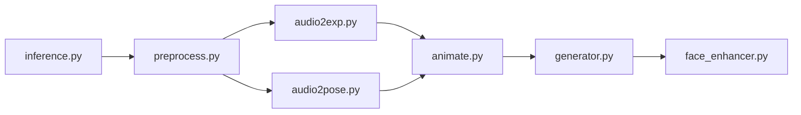

# OpenTalker/SadTalker

> Génère une vidéo de visage parlant à partir d'une image et d'un audio (CVPR 2023).

## Le problème
Animer un portrait avec une voix, avec mouvements 3D de tête et d'expression cohérents, est difficile.

## Ce que ça fait vraiment
Prépare le portrait, extrait des coefficients 3D, prédit expression et pose à partir de l'audio, puis un générateur neuronal produit les images, avec amélioration de visage facultative (GFPGAN). Modes still, plein cadre, redimensionnement, référence. Interface Gradio, extension stable-diffusion-webui, CLI.

## Comment c'est branché


## Essayer
```bash
git clone https://github.com/OpenTalker/SadTalker.git
conda create -n sadtalker python=3.8
pip install -r requirements.txt
bash scripts/download_models.sh
python inference.py --driven_audio <audio.wav> --source_image <video.mp4 or picture.png> --enhancer gfpgan
```

## Coût et pièges
Environnement ancien (Python 3.8, torch 1.12 / CUDA 11.3), poids à télécharger. Dernier push en juin 2024, 665 issues ouvertes. Licence non identifiée par GitHub (le README annonce Apache 2.0). Usages abusifs interdits par l'avertissement.

## Ce que ce n'est pas
Pas un produit Tencent officiel ; pas de garantie légale sur les sorties.

## Alternatives
Dans les travaux liés : StyleHEAT, VideoReTalking, DPE, CodeTalker.

## Pour toi
À regarder comme référence de recherche ; peu maintenu et dépendances anciennes, déconseillé en production.

