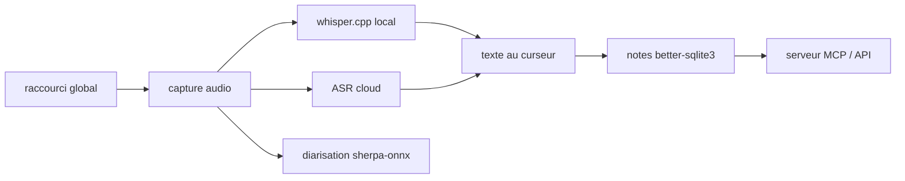

# OpenWhispr/openwhispr

> Dictée vocale et transcription de réunions sur le bureau, transcription locale possible.

## Le problème
Les outils de dictée et de prise de notes de réunion envoient l'audio chez un tiers, ce qui exclut tout contenu confidentiel.

## Ce que ça fait vraiment
Raccourci global : tu parles, le texte apparaît au curseur dans n'importe quelle application ; un second raccourci traduit à la volée.
Transcription de réunions avec détection automatique de Zoom, Teams et FaceTime, diarisation en direct, empreintes vocales, intégration calendrier.
Notes avec dossiers, recherche sémantique, synchronisation, espaces d'équipe et partage web.
Modèles locaux (Whisper via whisper.cpp, NVIDIA Parakeet via sherpa-onnx, Orukeet, Cohere Transcribe) ou fournisseurs cloud, au choix pour chaque fonction.

## Comment c'est branché


## Essayer
```bash
git clone https://github.com/OpenWhispr/openwhispr.git
cd openwhispr
npm install
npm run dev
```

## Coût et pièges
Local gratuit, mais l'agent IA et les fonctions cloud passent par des fournisseurs facturés (GPT-5, Claude, Gemini, Groq, OpenRouter). Node.js 24+ pour construire. Sur Mac Intel, ni identification de locuteur ni empreinte vocale : ONNX Runtime ne livre plus de binaires x86_64 depuis la 1.24, et la recherche de notes retombe sur du mot-clé.

## Ce que ce n'est pas
Pas entièrement local par défaut : le choix local/cloud est par fonction, et les espaces d'équipe passent par OpenWhispr Cloud (Neon Postgres). Pas un service : c'est une application Electron à installer poste par poste. Pas un remplaçant d'outil de visio : il écoute, il ne participe pas.

## Alternatives
WisprFlow et Granola — les deux produits dont le README se présente comme l'alternative libre.

## Pour toi
Le meilleur candidat pour dicter et transcrire sans laisser sortir l'audio, à condition de rester sur les modèles locaux.
