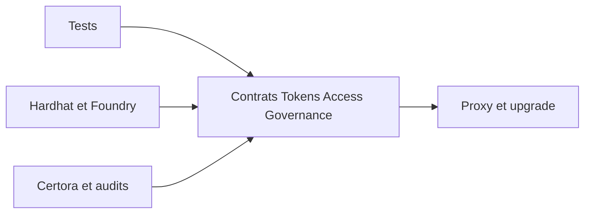

# OpenZeppelin/openzeppelin-contracts-upgradeable

> Version « upgradeable » des contrats Solidity OpenZeppelin : ERC20, ERC721, accès, gouvernance.

## Le problème
Écrire à la main des contrats de jetons et de permissions est risqué ; les rendre mettables à jour demande une gestion stricte du stockage.

## Ce que ça fait vraiment
Fournit des contrats réutilisables (ERC20, ERC721, ERC1155, ERC6909, contrôle d'accès par rôles, utilitaires) adaptés aux proxys, avec fonctions `initialize` au lieu de constructeurs. Étiquettes npm : `latest` (audité), `dev` (fini mais non audité), `next` (candidat).

## Comment c'est branché


## Essayer
```bash
npm install @openzeppelin/contracts-upgradeable
forge install OpenZeppelin/openzeppelin-contracts-upgradeable
```

## Coût et pièges
Le README avertit que les mises en page de stockage de versions majeures différentes sont incompatibles (4.9.3 vers 5.0.0 dangereux). Sous Foundry, `forge update` bascule sur `master` : préférer les tags. Ne pas copier ni modifier le code.

## Ce que ce n'est pas
Ce n'est pas un audit de ton code ; le README le précise et disclaimer toute garantie (MIT).

## Alternatives
- `@openzeppelin/contracts` : la version non upgradeable, à préférer si tu n'utilises pas de proxy.

## Pour toi
Ignorer : contrats de blockchain sans rôle dans un travail data, IA ou MLOps.

