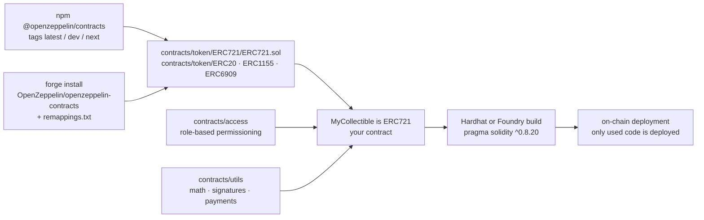

# OpenZeppelin/openzeppelin-contracts

> **Reviewed and audited Solidity building blocks — tokens, permissions, utilities — to import rather than rewrite.**

## The problem

Writing your own ERC-20 or access-control contract in Solidity means reimplementing a standard
whose every detail has already cost somebody money. A deployed contract cannot be patched: a
logic mistake ships permanently, and the audit that would have caught it costs more than the
project itself.

## What it actually does

It ships implementations of the token standards the README names — ERC-20, ERC-721, ERC-1155
and ERC-6909 — which you inherit from in three lines of your own contract.

It ships a role-based permissioning scheme: deciding who may perform each action in the
system, instead of a single hand-rolled `owner` check.

It ships reusable Solidity components — the README names non-overflowing math, signature
verification and trustless paying systems — meant to be assembled into custom contracts.

The code is designed so that **only the contracts and functions you actually use get
deployed**: importing the library does not inflate gas costs.

Around the code sits an explicit security apparatus: a disclosure policy in `SECURITY.md`,
past audits under `audits/`, engineering rules in `GUIDELINES.md`, and a bug bounty program
hosted on Immunefi. npm releases carry tags: `latest` (audited), `dev` (feature-complete but
not yet audited, still covered by the bounty) and `next` (release candidates).

## How it is wired



No code-derived diagram exists for this repository: the graph above is reconstructed from the
README alone, using the paths it quotes (`@openzeppelin/contracts/token/ERC721/ERC721.sol`).

## Trying it

```bash
$ npm install @openzeppelin/contracts
```

For the latest unaudited release, or for Foundry:

```bash
$ npm install @openzeppelin/contracts@dev
$ forge install OpenZeppelin/openzeppelin-contracts
```

With Foundry the README requires adding
`@openzeppelin/contracts/=lib/openzeppelin-contracts/contracts/` to `remappings.txt`. Then the
usage the README documents:

```solidity
pragma solidity ^0.8.20;

import {ERC721} from "@openzeppelin/contracts/token/ERC721/ERC721.sol";

contract MyCollectible is ERC721 {
    constructor() ERC721("MyCollectible", "MCO") {
    }
}
```

## Cost and gotchas

- **Free, MIT licensed**, no API key, no account. The real cost is elsewhere: the **gas** paid
  at deployment and on every on-chain call, which depends on what you build, not on the library.
- **Prerequisites**: Node and npm (Hardhat route) or Foundry (git route), plus a Solidity
  compiler matching `^0.8.20` per the README's example.
- **Do not install from `master`**: the README flags this twice as a common error. `master` is
  a development branch; the release process is what carries the security measures. Worse under
  Foundry, where subsequent `forge update` calls fall back to `master`.
- **npm tags**: `latest` is audited, `dev` is not yet, `next` is not final. Reflexively pinning
  `@dev` puts unaudited code into production.
- **Major versions are storage-incompatible**: the README insists that upgrading an upgradeable
  contract from 4.9.3 to 5.0.0 is unsafe.
- **Never copy-paste or modify the code**: the README asks that installed code be used as-is;
  system security depends on it.
- **Hosted dependencies**: the documentation site, Contracts Wizard, the forum and the bounty
  program are services run by OpenZeppelin and Immunefi — hence the alert kept on the sheet,
  even though the code itself works offline.

## What it is not

- **It is not an audit.** The README states it plainly: OpenZeppelin's audit reputation is no
  substitute for auditing *your* contract. The blocks are reviewed; your assembly of them is not.
- **It is not a warranty.** MIT disclaims all warranties and limits maintainer liability; the
  README adds that you assume all risk of use, under the Terms at openzeppelin.com/tos.
- **It is not a development framework, a chain, or a deployment tool**: Hardhat or Foundry
  compile and deploy, the library only supplies Solidity code. Nor does it cover upgradeable
  contracts, which live in a separate repository.

## Alternatives

The README names no competing library and no neighbours were supplied: **no comparable
alternative in the catalogue**. It does cite two companions, which do not replace the library
but change the entry point: **Contracts Wizard** (wizard.openzeppelin.com), an interactive
generator, preferable when starting a contract without hand-writing the scaffolding; and the
**openzeppelin-contracts-upgradeable** variant implied by the backwards-compatibility note,
preferable when the contract must be upgradable after deployment.

## For you

Strictly speaking this is outside data / AI / MLOps territory: it is on-chain Solidity, not
data and not models. Adopt it without hesitation if a project touches a blockchain — it is the
de facto foundation — and skip it otherwise, except for one transferable lesson: the release
discipline (audited vs unaudited tags, versioned audits, a bug bounty, announced version
incompatibility) is a model worth copying when shipping model artifacts.
