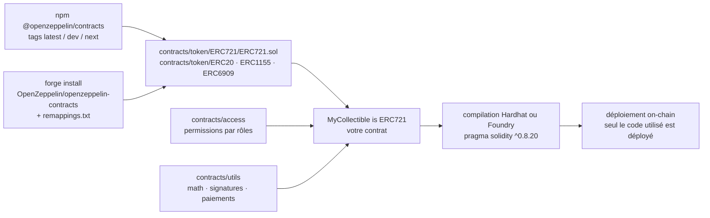

# OpenZeppelin/openzeppelin-contracts

> **Briques Solidity relues et auditées — jetons, permissions, utilitaires — à importer plutôt qu'à réécrire.**

## Le problème

Écrire soi-même un ERC-20 ou un contrôle d'accès en Solidity, c'est réimplémenter une norme
dont chaque détail a déjà coûté des fonds à quelqu'un. Un contrat déployé ne se corrige pas :
la faute de logique part en production définitivement, et l'audit qui l'aurait vue coûte plus
cher que le projet.

## Ce que ça fait vraiment

La bibliothèque fournit des implémentations des normes de jetons — le README cite ERC-20,
ERC-721, ERC-1155 et ERC-6909 — qu'on hérite en trois lignes dans son propre contrat.

Elle fournit un schéma de permissions par rôles : décider qui a le droit de faire quoi dans
le système, au lieu d'un `owner` unique codé à la main.

Elle fournit des composants Solidity réutilisables — le README nomme l'arithmétique sans
débordement, la vérification de signatures, des mécanismes de paiement sans tiers de
confiance — destinés à être assemblés dans des contrats sur mesure.

Le code est conçu pour que **seuls les contrats et fonctions réellement utilisés soient
déployés** : importer la bibliothèque n'alourdit pas le coût en gaz.

Autour du code, le dépôt porte un appareil de sécurité explicite : politique de divulgation
dans `SECURITY.md`, audits passés dans `audits/`, règles d'ingénierie dans `GUIDELINES.md`,
programme de primes aux bogues hébergé chez Immunefi. Les publications npm sont étiquetées
`latest` (audité), `dev` (fini mais non audité, couvert par la prime) et `next` (candidat).

## Comment c'est branché



Aucun diagramme tiré du code n'existe pour ce dépôt : ce schéma est reconstruit depuis le seul
README, avec les chemins qu'il cite (`@openzeppelin/contracts/token/ERC721/ERC721.sol`).

## Essayer

```bash
$ npm install @openzeppelin/contracts
```

Pour la dernière version non auditée, ou pour Foundry :

```bash
$ npm install @openzeppelin/contracts@dev
$ forge install OpenZeppelin/openzeppelin-contracts
```

Le README précise qu'avec Foundry il faut ajouter
`@openzeppelin/contracts/=lib/openzeppelin-contracts/contracts/` dans `remappings.txt`. Puis
l'usage tenu du README :

```solidity
pragma solidity ^0.8.20;

import {ERC721} from "@openzeppelin/contracts/token/ERC721/ERC721.sol";

contract MyCollectible is ERC721 {
    constructor() ERC721("MyCollectible", "MCO") {
    }
}
```

## Coût et pièges

- **Gratuit, licence MIT**, pas de clé d'API, pas de compte. Le coût réel est ailleurs : le
  **gaz** payé à chaque déploiement et à chaque appel on-chain, qui ne dépend pas de la
  bibliothèque mais de ce qu'on en fait.
- **Prérequis** : Node et npm (voie Hardhat) ou Foundry (voie git), et un compilateur Solidity
  `^0.8.20` d'après l'exemple du README.
- **Ne pas installer depuis `master`** : le README le signale deux fois comme erreur courante.
  `master` est une branche de développement ; le processus de publication, lui, porte les
  mesures de sécurité. Piège aggravé sous Foundry, où `forge update` repart sur `master`.
- **Tags npm** : `latest` est audité, `dev` ne l'est pas encore, `next` n'est pas final. Un
  `@dev` posé par réflexe met du code non audité en production.
- **Versions majeures incompatibles en stockage** : le README insiste — passer de 4.9.3 à 5.0.0
  sur un contrat évolutif n'est pas sûr.
- **Ne jamais copier-coller ni modifier le code** : le README demande d'utiliser le code
  installé tel quel, la sécurité du système en dépend.
- **Dépendances de service** : la documentation, le générateur Contracts Wizard, le forum et
  la prime aux bogues sont des services hébergés par OpenZeppelin et Immunefi — c'est l'alerte
  retenue, le code lui-même restant utilisable hors ligne.

## Ce que ce n'est pas

- **Ce n'est pas un audit.** Le README le dit sans détour : la réputation d'OpenZeppelin en
  matière d'audit ne dispense pas d'auditer *votre* contrat. Les briques sont relues ; leur
  assemblage ne l'est pas.
- **Ce n'est pas une garantie.** MIT décline toute garantie et limite la responsabilité des
  mainteneurs ; le README rappelle que l'usage est au risque de l'utilisateur, sous les
  Conditions d'openzeppelin.com/tos.
- **Ce n'est ni un cadre de développement, ni une chaîne, ni un outil de déploiement** :
  Hardhat ou Foundry compilent et déploient, la bibliothèque ne fait que fournir le code
  Solidity. Et elle ne couvre pas les contrats évolutifs, qui vivent dans un dépôt séparé.

## Alternatives

Le README ne nomme aucune bibliothèque concurrente et aucun voisin n'a été fourni :
**aucune alternative comparable dans le catalogue**. Deux compagnons y sont en revanche cités,
qui ne remplacent pas la bibliothèque mais changent le point d'entrée : **Contracts Wizard**
(wizard.openzeppelin.com), générateur interactif à préférer pour démarrer un contrat sans
écrire l'ossature à la main ; et la variante **openzeppelin-contracts-upgradeable**, impliquée
par la section sur la compatibilité ascendante, à préférer quand le contrat doit pouvoir être
mis à jour après déploiement.

## Pour toi

Hors périmètre data / IA / MLOps au sens strict : c'est du Solidity on-chain, pas de la
donnée ni du modèle. À adopter sans réfléchir si un projet touche à la blockchain — c'est le
socle de fait — et à ignorer sinon, sauf pour une leçon transférable : la discipline de
publication (tags audité / non audité, audits versionnés, prime aux bogues, incompatibilité de
version annoncée) est un modèle réutilisable pour livrer des artefacts de modèle.
