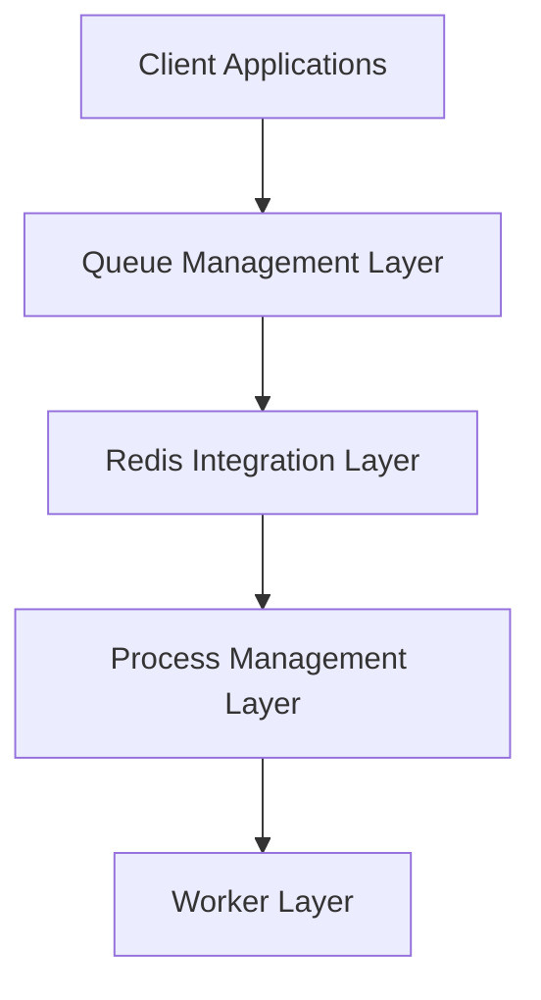

# OptimalBits/bull

> File de tâches Node.js adossée à Redis : retries, priorités, jobs cron.

## Le problème
Une appli Node a besoin de traitements en arrière-plan fiables, avec nouvelles tentatives, délais et reprise après crash.

## Ce que ça fait vraiment
Les files sont stockées dans Redis avec des opérations atomiques (scripts Lua) et sans polling.
Il gère les jobs différés, les répétitions cron, la limitation de débit, les priorités et la concurrence.
Les workers peuvent tourner dans des processus séparés et isolés.
La livraison est « au moins une fois » : un job peut être traité deux fois s'il perd son verrou.

## Comment c'est branché


## Essayer
```bash
npm install bull --save
yarn add bull
npm install @types/bull --save-dev
```

## Coût et pièges
Il faut Redis 2.8.18 ou plus. L'interface officielle, Taskforce.sh, est payante. Il faut surveiller l'événement `stalled`.

## Ce que ce n'est pas
Ce n'est pas la version active : le tableau du README met en avant BullMQ. Le code est en Node, pas en Python.

## Alternatives
- BullMQ : successeur, avec dépendances parent/enfant.
- Kue, Bee (Redis) ou Agenda (Mongo) : plus simples mais moins complets.

## Pour toi
À ignorer : c'est un outil Node en fin de parcours. Pour tes pipelines Python, il ne te concerne pas.
