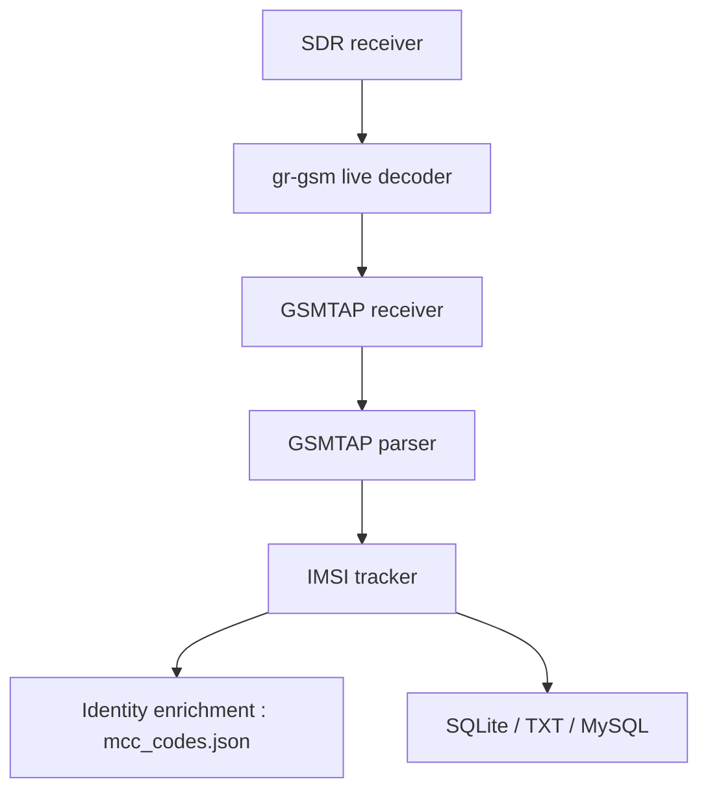

# Oros42/IMSI-catcher

> Programme qui affiche numéros IMSI, pays et opérateurs des téléphones proches, à des fins pédagogiques sur le réseau GSM.

## Le problème
Comprendre comment fonctionne le réseau GSM en observant les identités qui y circulent.

## Ce que ça fait vraiment
Reçoit du trafic GSMTAP décodé par gr-gsm, en extrait IMSI et TMSI, ajoute pays et opérateur via les codes MCC/MNC, et affiche ou enregistre (SQLite, texte, MySQL). Il faut un PC Linux et une radio logicielle (clé RTL2832U, HackRF, BladeRF…).

## Comment c'est branché


## Essayer
```bash
sudo apt install python3-numpy python3-scipy python3-scapy gr-gsm
python3 simple_IMSI-catcher.py -h
sudo python3 simple_IMSI-catcher.py -s
grgsm_livemon
```

## Coût et pièges
Gratuit côté logiciel, matériel radio à prévoir (clé à moins de 15 $ selon le README). Pas Python 3.9. Captation de données d'identité mobile : cadre légal à vérifier.

## Ce que ce n'est pas
Le README précise que c'est pour comprendre le GSM, pas pour du piratage. Pas un outil d'IA.

## Alternatives
Aucune alternative nommée dans le README.

## Pour toi
À ignorer : hors périmètre data/IA et sensible juridiquement ; utile seulement pour un travail de recherche radio encadré.

