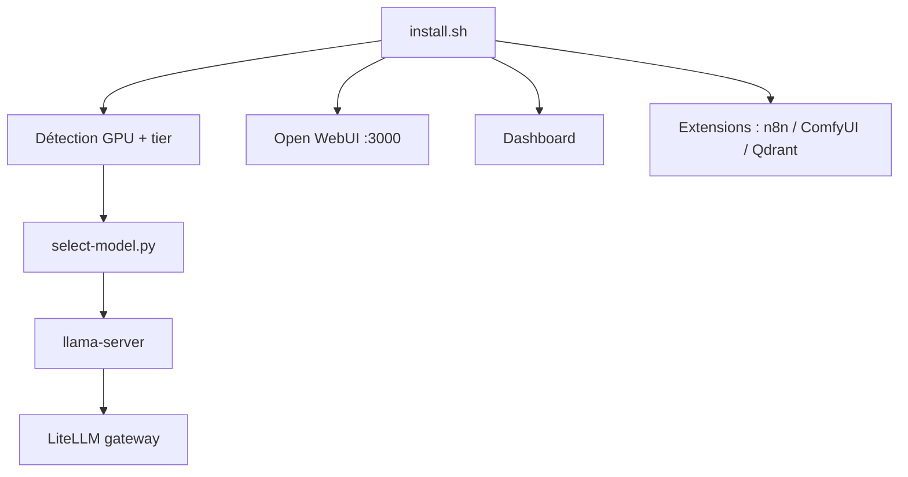

# Osmantic/ODS

> Installeur qui transforme un PC/Mac/Linux en serveur IA privé complet, tout câblé.

## Le problème
Monter un serveur IA local exige d'assembler à la main Ollama, Open WebUI, n8n, ComfyUI, outils de confidentialité — configs Docker écrites de zéro, tout doit se parler. Beaucoup abandonnent.

## Ce que ça fait vraiment
Une commande détecte le GPU, choisit le modèle adapté, génère les credentials et lance tout : inférence locale (llama-server), chat Open WebUI, dashboard de contrôle, voix (Whisper/Kokoro), agents (Hermes), n8n, RAG (Qdrant + embeddings), recherche (SearXNG/Perplexica), image (ComfyUI), confidentialité (Privacy Shield), observabilité (Langfuse). Auto-détection matérielle avec catalogue de modèles par tier (NVIDIA/AMD Strix Halo/Apple/Intel Arc). Chaque service est une extension hot-pluggable. Mode bootstrap : petit modèle en <1 min puis hot-swap.

## Comment c'est branché


## Essayer
```bash
curl -fsSL https://install.osmantic.com/ods.sh | bash
```
```bash
ods status
ods model swap T3
```

## Coût et pièges
Cœur local gratuit. Mode cloud optionnel (`./install.sh --cloud`) via OpenAI/Anthropic/Together, clés à ta charge. Docker requis (Docker Desktop + WSL2 sur Windows). Endpoint d'install hébergé proxie `main` : vérifier le script (Installer Trust). Mainteneur unique.

## Ce que ce n'est pas
Pas un modèle ni un service hébergé : un orchestrateur d'installation qui câble des projets tiers existants.

## Alternatives
- Ollama + Open WebUI : LLM + chat seuls.
- LocalAI : LLM seul.
- n8n self-hosted AI starter kits : l'automatisation seule.

## Pour toi
Attrayant pour monter vite un labo IA privé complet ; surveiller (mainteneur unique, endpoint d'install hébergé).
