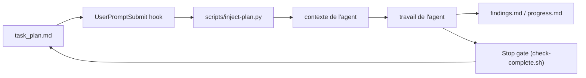

# OthmanAdi/planning-with-files

> Skill qui garde le plan d'un agent sur disque et le réinjecte à chaque tour.

## Le problème
Un `/clear`, une compaction ou un plantage efface la mémoire de travail : l'agent redécouvre ce qu'il a déjà fait.
Après cinquante appels d'outils, l'objectif initial sort de la fenêtre d'attention.

## Ce que ça fait vraiment
Trois fichiers markdown : `task_plan.md` (phases et cases à cocher), `findings.md` (notes), `progress.md` (journal).
Des hooks `SessionStart`, `UserPromptSubmit` et `PreCompact` réinjectent la phase courante dans le contexte.
Mode « gated » : un hook Stop retient l'arrêt tant qu'une phase reste `in_progress`, avec plafond de blocage et détection de stagnation.
Attestation SHA-256 : un plan modifié hors approbation est refusé à l'injection avec `[PLAN TAMPERED]` ; `/plan-doctor` vérifie l'installation.

## Comment c'est branché


## Essayer
```bash
npx skills add OthmanAdi/planning-with-files --skill planning-with-files -g
npm install planning-with-files
pi install npm:planning-with-files
hermes plugins install OthmanAdi/planning-with-files/.hermes/plugins/planning-with-files
dsh plugin --profile web add dsh-planning-with-files
```

## Coût et pièges
Gratuit, mais la route « skill » peut s'installer silencieusement sans hooks — or les hooks sont tout le mécanisme.
Les fichiers de plan sont gitignorés et non archivés : la tâche suivante écrase le plan racine.

## Ce que ce n'est pas
Ce n'est pas une mémoire d'agent : il gère l'état d'exécution courant, pas la récupération de faits passés.
Ce n'est pas un résultat mesuré à jour : les 5,0 tours contre 13,3 viennent d'un banc interne, auto-administré, sur un comportement par défaut qui a changé depuis.
Ce n'est pas un livrable : ce qui doit survivre doit être promu en code, commit ou document.
Le README fourni ici est tronqué au milieu de l'historique des versions.

## Alternatives
Le mode plan de Claude Code : complémentaire, il conçoit l'approche avant exécution là où ce skill persiste l'état pendant.

## Pour toi
Utile pour les tâches longues et autonomes ; installe par la route plugin puis vérifie avec `/plan-doctor`, sinon tu n'auras rien.
