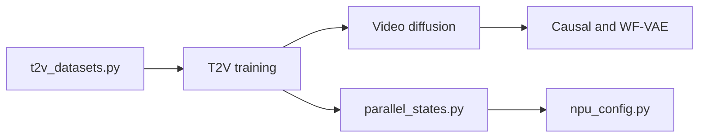

# PKU-YuanGroup/Open-Sora-Plan

> Projet de recherche ouvert pour reproduire un modèle de génération vidéo de type Sora.

## Le problème
Les modèles texte-vers-vidéo de pointe sont fermés, ce qui complique l'étude et la reproduction.

## Ce que ça fait vraiment
Publie des versions successives (v1.0 à v1.5) d'un VAE vidéo (WF-VAE) et d'un DiT à attention creuse (SUV, annoncé plus de 35 % plus rapide). Le dépôt contient entraînement, inpainting, raffineur de prompt, interpolation d'images et interface de génération. La v1.5 est entraînée sur Huawei Ascend.

## Comment c'est branché


## Essayer
```bash
# Aucune commande documentée : GPU « coming soon ».
# NPU : basculer sur la branche mindspeed_mmdit et suivre son README.
```

## Coût et pièges
Les poids v1.5 ne fonctionnent qu'avec NPU + MindSpeed-MM ; le mode GPU n'est pas encore disponible. Certains poids ont des filigranes.

## Ce que ce n'est pas
Ce n'est pas utilisable sur GPU grand public en l'état pour la v1.5. Les modèles 2+1D ne sont plus supportés depuis la v1.2.

## Alternatives
Non documenté : le README ne nomme pas d'alternative.

## Pour toi
Surveiller : utile pour lire une recherche ouverte sur la vidéo générative, mais inutilisable sur GPU tant que le mode GPU n'est pas publié.

