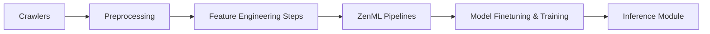

# PacktPublishing/LLM-Engineers-Handbook

> Code du livre : système LLM de bout en bout avec pipelines ZenML, RAG et déploiement AWS.

## Le problème
Voir comment assembler collecte de données, fine-tuning, RAG et déploiement dans un même projet cohérent.

## Ce que ça fait vraiment
Pipelines ZenML de collecte (crawlers LinkedIn, Medium, GitHub), feature engineering, génération de jeux instruct et préférences, entraînement SFT/DPO et évaluation sur SageMaker, RAG avec Qdrant et MongoDB, service d'inférence REST. Structure DDD (domain, application, model, infrastructure). Suivi avec Comet ML et Opik.

## Comment c'est branché


## Essayer
```bash
git clone https://github.com/PacktPublishing/LLM-Engineers-Handbook.git
poetry env use 3.11
poetry install --without aws
poetry poe local-infrastructure-up
poetry poe run-digital-data-etl
```

## Coût et pièges
Environ 25 $ pour un run complet avec les valeurs par défaut (surtout SageMaker). Comptes HuggingFace, Comet, AWS, OpenAI requis. Entraînement et inférence exigent SageMaker. Chrome requis pour les crawlers.

## Ce que ce n'est pas
Un support pédagogique lié au livre, pas une bibliothèque réutilisable. Le code peut être plus récent que le livre.

## Alternatives
Le README ne nomme aucune alternative.

## Pour toi
À surveiller : bon exemple de MLOps complet pour apprendre à orchestrer avec ZenML, à lire plus qu'à déployer tel quel.
