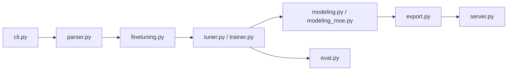

# PaddlePaddle/ERNIE

> Famille ERNIE 4.5 de modèles ouverts (texte et vision) avec outils d'entraînement et de déploiement sur PaddlePaddle.

## Le problème
Disposer de grands modèles MoE multimodaux ouverts, avec de quoi les affiner et les servir, sans dépendre d'une API fermée.

## Ce que ça fait vraiment
Publie dix variantes ERNIE 4.5 (LLM de 0,3B à 300B-A47B, VLM jusqu'à 424B-A47B) sous Apache 2.0. ERNIEKit couvre SFT, DPO, LoRA et QAT ; FastDeploy sert les modèles avec une API compatible OpenAI. L'entraînement des VLM est annoncé « Coming Soon » dans la matrice du README. Le code analysé montre CLI, parseur d'arguments, WebUI, tuner, trainer SFT, évaluation, export et serveur.

## Comment c'est branché


## Essayer
```bash
huggingface-cli download baidu/ERNIE-4.5-0.3B-Paddle --local-dir baidu/ERNIE-4.5-0.3B-Paddle
erniekit train examples/configs/ERNIE-4.5-0.3B/sft/run_sft_8k.yaml
python -m fastdeploy.entrypoints.openai.api_server \
    --model "baidu/ERNIE-4.5-0.3B-Paddle" \
    --max-model-len 32768 \
    --port 9904
```

## Coût et pièges
Les gros modèles exigent des GPU nombreux ; les besoins matériels d'entraînement sont renvoyés à une page externe. Le README ne donne pas la commande d'installation d'ERNIEKit ni de FastDeploy.

## Ce que ce n'est pas
Pas un écosystème PyTorch : tout passe par PaddlePaddle. Les benchmarks sont ceux de l'éditeur. Le 0,3B sert à tester, pas à juger les gros modèles.

## Alternatives
- DeepSeek-V3 et Qwen3 : cités dans le README comme références de comparaison.

## Pour toi
À surveiller : les poids ouverts Apache 2.0 valent un essai, mais l'outillage Paddle éloigne d'une stack PyTorch habituelle et l'installation n'est pas décrite ici.

