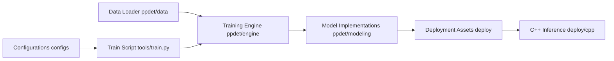

# PaddlePaddle/PaddleDetection

> Boîte à outils de détection d'objets sur PaddlePaddle ; README anglais vide, renvoi au chinois.

## Le problème
Non documenté dans le README fourni (il ne contient que « README_cn.md »).

## Ce que ça fait vraiment
D'après l'architecture décrite : chargement et transformation de données (`ppdet/data`), modèles configurés en YAML (`configs`).
Backbones, necks, heads dans `ppdet/modeling`, zoo de modèles pré-entraînés, moteur d'entraînement `ppdet/engine`.
Export et déploiement : `deploy/serving`, `deploy/fastdeploy`, inférence C++.

## Comment c'est branché

## Essayer
Aucune commande documentée dans le README fourni.

## Coût et pièges
Gratuit ; entraînement sur GPU, dépendance au framework PaddlePaddle.

## Ce que ce n'est pas
Pas une bibliothèque PyTorch. La doc réelle est dans `README_cn.md`, non fournie ici.

## Alternatives
Aucune alternative nommée dans le README.

## Pour toi
À surveiller seulement si tu dois déployer de la détection sur l'écosystème Paddle ; matière trop mince ici pour trancher davantage.
