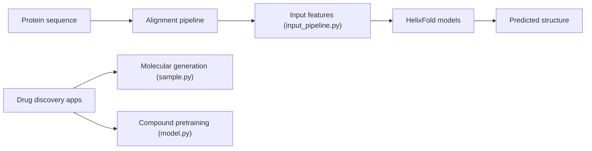

# PaddlePaddle/PaddleHelix

> Boîte à outils de bio-informatique par apprentissage profond sur PaddlePaddle : médicaments, protéines, ARN.

## Le problème
Les chercheurs en découverte de médicaments et en conception de vaccins manquent d'un ensemble cohérent de modèles pré-entraînés et d'applications.

## Ce que ça fait vraiment
Dépôt de recherche regroupant pré-entraînement de composés et de protéines, prédiction de propriétés et d'affinité médicament-cible (GraphDTA, MolTrans), génération moléculaire, synergie médicamenteuse, repliement de protéines (HelixFold, HelixFold-Single, HelixFold3), algorithmes ARN (LinearFold, LinearPartition) et solutions de compétition. Chaque application a son propre dossier, sans couche commune.

## Comment c'est branché

## Essayer
Aucune commande documentée dans le README : il renvoie vers un guide d'installation et des tutoriels externes.

## Coût et pièges
Gratuit, mais l'installation, le GPU éventuel et la version de Python ne sont pas précisés dans ce README. Basé sur PaddlePaddle, pas PyTorch. 76 issues ouvertes.

## Ce que ce n'est pas
Ce n'est pas un service prêt à l'emploi : c'est un ensemble d'applications de recherche hétérogènes. Licence présente mais non identifiée par GitHub.

## Alternatives
Aucune alternative nommée dans le README.

## Pour toi
À surveiller : utile seulement si tu travailles sur la bio-informatique et acceptes PaddlePaddle ; vérifie la licence avant toute réutilisation.

