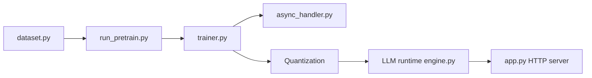

# PaddlePaddle/PaddleNLP

> Suite d'entraînement, compression et inférence de grands modèles sur le framework PaddlePaddle.

## Le problème
Entraîner et servir un LLM sur plusieurs types de matériel demande de recoller parallélisme, précision et quantification.

## Ce que ça fait vraiment
Pré-entraînement 4D (données, tenseur, pipeline, fragmentation des paramètres), affinage (SFT, LoRA, FlashMask, DPO et variantes), quantification et inférence optimisée (INT8/INT4, FP8). Matériel : GPU NVIDIA, XPU, NPU Ascend, GCU, DCU. Modèles : Llama, Qwen, DeepSeek, ChatGLM, Baichuan, Mistral, etc. Checkpoint unifié avec sauvegarde asynchrone.

## Comment c'est branché


## Essayer
```bash
pip install --upgrade paddlenlp==3.0.0b4
python -u run_pretrain.py ./config/qwen/pretrain_argument_0p5b.json
python -u run_finetune.py ./config/qwen/sft_argument_0p5b.json
```

## Coût et pièges
Nécessite `paddlepaddle >= 3.0.0rc1` et Python 3.8+. Écosystème Paddle distinct de PyTorch. README en chinois d'abord.

## Ce que ce n'est pas
Ce n'est pas un wrapper PyTorch : c'est un autre framework. L'exemple de pré-entraînement suppose de télécharger les données d'exemple.

## Alternatives
Non documenté : le README ne nomme pas d'alternative.

## Pour toi
Surveiller : intéressant si tu cibles du matériel chinois (Ascend, Kunlun) ; sinon l'écosystème PyTorch reste plus courant.

