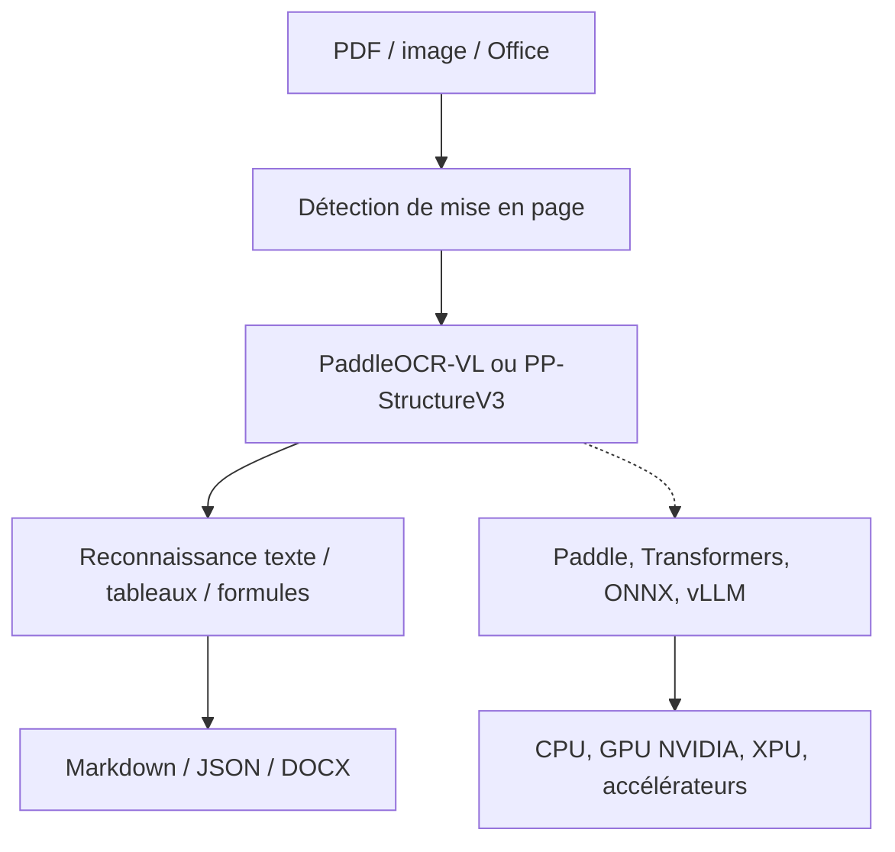

# PaddlePaddle/PaddleOCR

> Boîte à outils OCR et moteur de compréhension documentaire, qui rend du Markdown et du JSON.

## Le problème
Un PDF scanné ou une photo de document ne donne rien d'exploitable à un LLM.
Les OCR généralistes perdent la mise en page, les tableaux et les formules.

## Ce que ça fait vraiment
PaddleOCR-VL-1.6 (0,9 Md de paramètres) parse une page en Markdown ou JSON structuré.
PP-StructureV3 fait la même chose avec des coordonnées fines : cellules de tableau, blocs de texte.
PP-OCRv6 reconnaît 50 langues avec un seul modèle, en trois tailles : 1,5 M, 7,7 M et 34,5 M de paramètres.
HPD-Parsing vise le débit, servi via un runtime vLLM personnalisé ou une API compatible OpenAI.
Export ONNX, accélération OpenVINO/TensorRT, inférence parallèle multi-GPU, SDK navigateur `PaddleOCR.js`.

## Comment c'est branché

## Essayer
Aucune commande d'installation n'est donnée dans le README : il renvoie aux pages PP-OCR, PaddleOCR-VL et PP-StructureV3.

## Coût et pièges
Gratuit et exécutable localement. Sans GPU, le parsing VL reste lent malgré les gains CPU annoncés.
Les modèles se téléchargent depuis HuggingFace, ModelScope ou AIStudio — prévoir la bande passante.

## Ce que ce n'est pas
Pas un simple `pip install` : la version du framework Paddle et le backend matériel conditionnent tout.
Les chiffres de précision (96,3 % sur OmniDocBench v1.6) sont auto-rapportés par l'éditeur.
Pas un pipeline RAG : ça produit du texte structuré, rien d'autre.

## Alternatives
- `microsoft/markitdown` : plus simple, quand les documents sont nativement numériques.
- `infiniflow/ragflow` : intègre déjà ce type de parsing dans une chaîne complète.

## Pour toi
La meilleure brique OCR/document du lot pour alimenter un RAG à partir de scans. À adopter.
