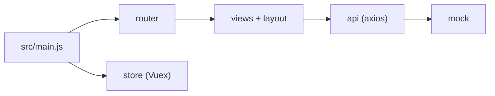

# PanJiaChen/vue-admin-template

> Gabarit minimal d'interface d'administration Vue avec Element UI, pour démarrer un back-office.

## Le problème
Démarrer un back-office demande un routage, une mise en page, un état global et une couche d'appels API avant de coder la moindre fonction.

## Ce que ça fait vraiment
Un projet vue-cli prêt à cloner : Vue Router, Vuex (modules app, settings, user), Element UI, axios, un serveur mock pour le développement, des icônes SVG, ESLint et des tests unitaires. Le README indique que le contrôle de permission par rôle est dans une autre branche, et cite une version TypeScript à part.

## Comment c'est branché


## Essayer
```bash
git clone https://github.com/PanJiaChen/vue-admin-template.git
cd vue-admin-template
npm install
npm run dev
npm run build:prod
npm run lint
```

## Coût et pièges
Gratuit. Version 4.0 ou plus sur vue-cli ; l'ancienne version sans vue-cli est sur le tag 3.11.0. Dernier push le 2024-04-27, soit plus d'un an. Cible Vue 2 et Element UI, pas Vue 3.

## Ce que ce n'est pas
Pas une application complète : c'est un squelette avec de fausses données. La permission par rôle n'est pas dans la branche principale.

## Alternatives
`vue-element-admin` (version complète), `vue-typescript-admin-template` et `electron-vue-admin`, cités dans le README.

## Pour toi
Ignorer : gabarit Vue 2 ancien, maintenu par une personne, sans lien avec la donnée ; utile seulement pour un back-office jetable.

