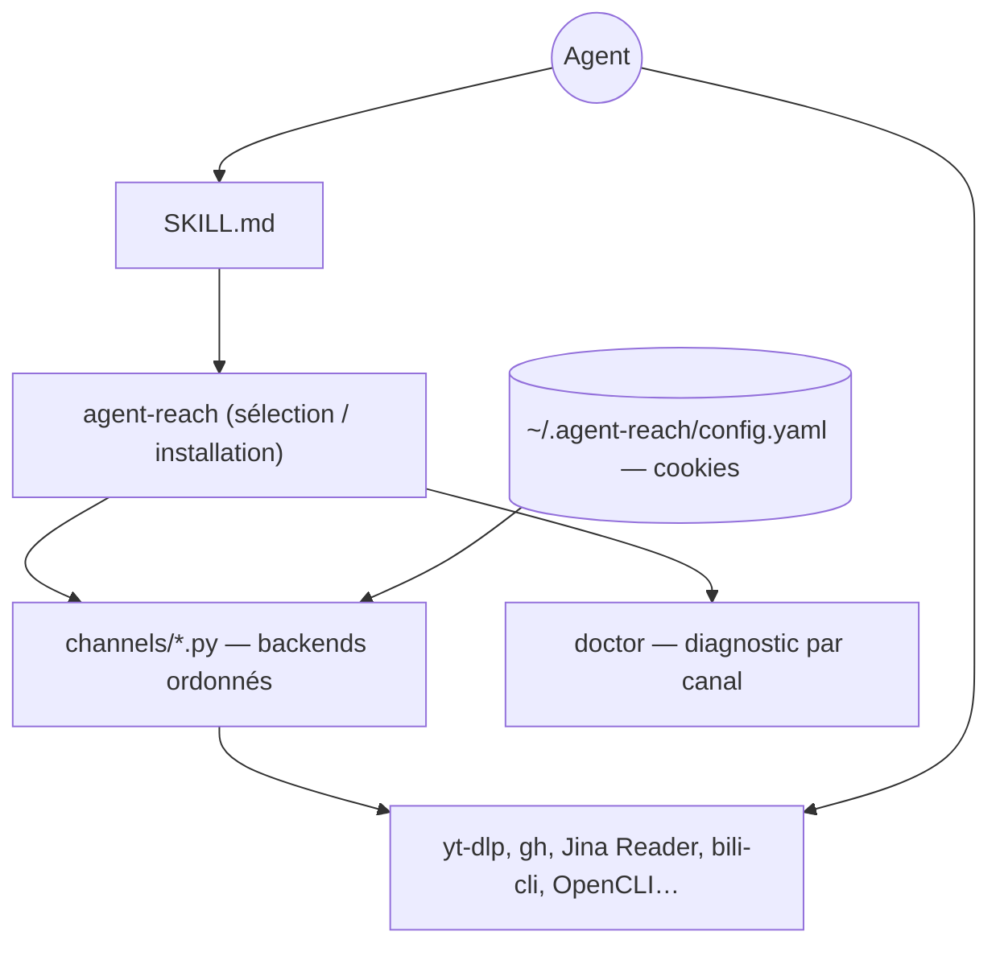

# Panniantong/Agent-Reach

> Couche d'installation qui donne à un agent l'accès aux plateformes web verrouillées, en chinois.

## Le problème
Un agent sait coder mais ne sait pas lire Twitter, Reddit, Bilibili ou Xiaohongshu.
Chaque plateforme a sa barrière : API payante, blocage d'IP serveur, connexion obligatoire.

## Ce que ça fait vraiment
Ne lit rien lui-même : il sélectionne, installe et diagnostique les outils en amont, puis l'agent les appelle.
Chaque plateforme est une liste ordonnée de backends (préféré puis secours) dans un fichier `channels/*.py`.
`agent-reach doctor` sonde réellement chaque backend et dit lequel est actif et comment réparer.
Six canaux fonctionnent sans configuration (web, YouTube, RSS, GitHub public, recherche Exa, V2EX).

## Comment c'est branché


## Essayer
```bash
agent-reach install --env=auto --dry-run
agent-reach install --env=auto --system
agent-reach doctor
agent-reach uninstall --dry-run
```

## Coût et pièges
Gratuit ; seul un proxy serveur (~1 $/mois) peut coûter. Les cookies restent locaux en `600`.
Le README prévient : les appels par cookie exposent à un bannissement — utiliser un compte secondaire.

## Ce que ce n'est pas
Pas une couche d'abstraction stable : les backends changent quand les plateformes durcissent leurs blocages.
Pas neutre juridiquement — plusieurs canaux contournent explicitement une restriction d'accès.
Documentation entièrement en chinois, sans licence déclarée.

## Alternatives
- `unclecode/crawl4ai` : pour le web ouvert, sans gestion de sessions authentifiées.
- `browser-use/browser-use` : contrôle d'un vrai navigateur, avec profil Chrome existant.

## Pour toi
Périmètre centré sur les plateformes chinoises, cadre juridique flou, pas de licence. À ignorer.
