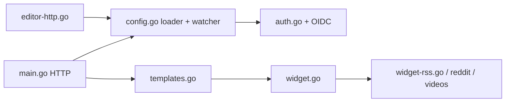

# Panonim/dynacat

> Tableau de bord auto-hébergé, léger et configurable en YAML, avec éditeur graphique, pour suivre flux et services.

## Le problème
Suivre RSS, Reddit, météo, marchés et statut de conteneurs demande d'ouvrir autant d'onglets que de sources.

## Ce que ça fait vraiment
Un binaire Go unique (moins de 20 Mo) qui lit un fichier YAML, rend une page HTML avec des widgets (RSS, Hacker News, Reddit, YouTube, Twitch, marchés, statut Docker, statistiques serveur, todo, widgets personnalisés), plusieurs pages et thèmes. Un éditeur intégré réécrit le même YAML. Authentification OIDC optionnelle, état SQLite pour certains widgets.

## Comment c'est branché


## Essayer
```bash
mkdir dynacat && cd dynacat && \
curl -sL https://github.com/Panonim/dynacat-compose-template/releases/latest/download/dynacat.tar.gz | tar -xzf - && \
docker compose up -d
```

## Coût et pièges
Gratuit. Le port 8080 est exposé ; monter le socket Docker donne accès au moteur pour le widget de conteneurs. Un DNS bloqueur (Pi-hole) trop limité provoque des délais, et Dark Reader casse la mise en page.

## Ce que ce n'est pas
Pas un outil de supervision ni d'alerte : il affiche, il ne surveille pas. AGPL-3.0, avec les obligations de l'hébergement modifié.

## Alternatives
Homepage, cité dans le README comme hôte possible d'un iframe Dynacat.

## Pour toi
À ignorer : tableau de bord de veille perso sans lien avec un travail data/IA/MLOps.
