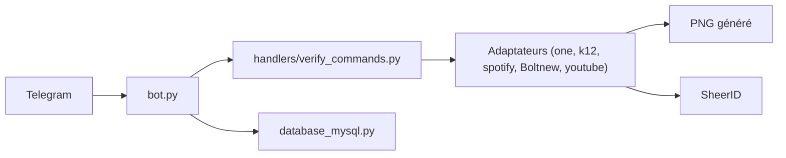

# PastKing/tgbot-verify

> Bot Telegram qui fabrique de faux justificatifs pour passer les vérifications SheerID étudiant ou enseignant.

## Le problème
Le README vise à obtenir des offres réservées aux étudiants ou enseignants (Gemini, ChatGPT, Spotify, Bolt.new) sans y avoir droit.

## Ce que ça fait vraiment
À partir d'une URL SheerID, le bot génère une identité fictive et des images de carte étudiante ou enseignant, puis les soumet à SheerID. Il ajoute une gestion de crédits (signature, invitation, cartes-clés), une base MySQL et des commandes d'administration. Les `programId` de chaque service changent et doivent être mis à jour à la main.

## Comment c'est branché

## Essayer
Commandes volontairement non reproduites : l'outil sert à falsifier des justificatifs pour contourner une vérification d'identité.

## Coût et pièges
Bot Telegram, MySQL 5.7+, Playwright. Usage contraire aux conditions des services visés et risque juridique ; les `programId` expirent.

## Ce que ce n'est pas
Pas un outil de vérification légitime : il contourne la vérification. Le README est en chinois et aucun garde-fou n'est décrit.

## Alternatives
Aucune alternative nommée dans le README.

## Pour toi
À ignorer : outil de fraude aux justificatifs, sans usage professionnel légitime pour un profil data/IA/MLOps.

