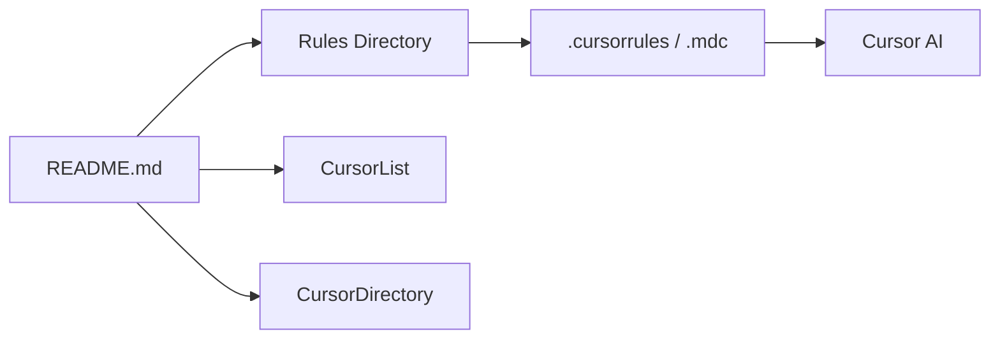

# PatrickJS/awesome-cursorrules

> Liste de règles de projet pour l'éditeur Cursor, classées par technologie, pour développeurs qui guident l'IA.

## Le problème
Un assistant de code sans consignes propres au projet produit un code qui ne suit ni la pile technique ni le style de l'équipe.

## Ce que ça fait vraiment
Un catalogue de fichiers `.mdc` à copier dans `.cursor/rules/`, classés par catégories : frontend, backend, mobile, jeux, CSS, état, base de données/API, tests, déploiement, outils, langages, sécurité, documentation. On y trouve aussi des règles Python, PyTorch, TensorFlow, pandas, PySpark, AutoML et Snowflake. Certaines entrées sont soutenues par des sponsors ou portent des services tiers.

## Comment c'est branché


## Essayer
```bash
# Aucune commande : créer .cursor/rules/, y copier le .mdc choisi, puis l'adapter au projet
```

## Coût et pièges
Gratuit (CC0-1.0). La qualité des règles varie selon les contributeurs et rien ne les valide dans le README.

## Ce que ce n'est pas
Pas un outil exécutable ni une bibliothèque : de simples fichiers de consignes. Ils visent Cursor, pas d'autres assistants.

## Alternatives
- CursorList : annuaire de règles cité dans le README.
- CursorDirectory : autre annuaire cité.

## Pour toi
Surveiller : piocher des idées de consignes pour Python et ML, à transposer dans tes propres fichiers d'instructions, plutôt que de tout copier.

