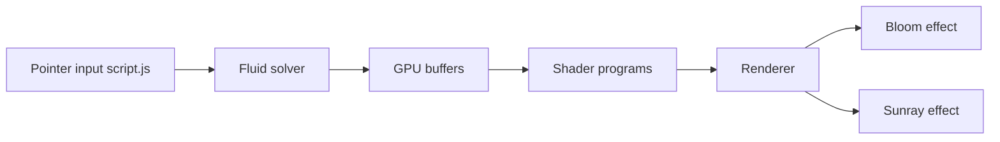

# PavelDoGreat/WebGL-Fluid-Simulation

> Simulation de fluide en WebGL dans le navigateur, interactive à la souris.

## Le problème
Non documenté dans le README : l'intention est une démonstration de dynamique des fluides sur GPU.

## Ce que ça fait vraiment
README minimal (un lien « Play here » et trois références dont un chapitre NVIDIA GPU Gems). D'après le code décrit : un seul fichier `script.js` gère la saisie du pointeur, les réglages, le solveur sur GPU, les tampons, les shaders, et des effets de bloom et de rayons de soleil.

## Comment c'est branché


## Essayer
```bash
# Aucune commande documentée.
```

## Coût et pièges
Gratuit (MIT). Dernier push en novembre 2024. README trop court pour juger la compatibilité navigateur.

## Ce que ce n'est pas
Pas une bibliothèque réutilisable : tout est dans un seul script ; pas un simulateur physique rigoureux.

## Alternatives
Références citées dans le README : mharrys/fluids-2d et haxiomic/GPU-Fluid-Experiments.

## Pour toi
Curiosité graphique, lisible comme exemple de calcul GPU en shaders ; rien pour un pipeline data/IA.

