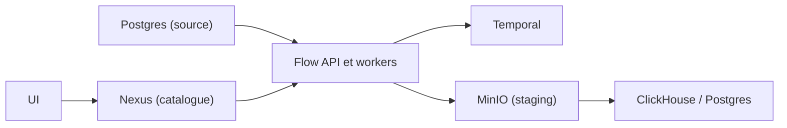

# PeerDB-io/peerdb

> Réplication de Postgres vers ClickHouse ou Postgres par CDC, pilotée en SQL, pour équipes data.

## Le problème
Sortir des données de Postgres vers un entrepôt analytique sans écrire de pipeline maison, avec gros volumes, colonnes TOAST et changements de schéma.

## Ce que ça fait vraiment
Des « mirrors » copient Postgres (et MySQL, MongoDB, CockroachDB, BigQuery en source) vers ClickHouse ou Postgres. Mode recommandé : CDC. Les modes cursor/QRep et XMIN sont dépréciés, ainsi que les destinations Snowflake, BigQuery, Kafka, S3, Elasticsearch, Event Hubs, Pub/Sub. Une interface compatible Postgres (port 9900) sert à créer les mirrors. Les fichiers sont stagés dans MinIO ; Temporal orchestre les workflows.

## Comment c'est branché


## Essayer
```bash
git clone git@github.com:PeerDB-io/peerdb.git
cd peerdb
bash ./run-peerdb.sh
psql "port=9900 host=localhost password=peerdb"
```

## Coût et pièges
Gratuit auto-hébergé, mais Docker, Temporal, MinIO et une base catalogue tournent en local. Si ClickHouse est hors Docker, il doit atteindre MinIO (`AWS_ENDPOINT_URL_S3`). 205 issues ouvertes.

## Ce que ce n'est pas
Pas un ETL généraliste : la plupart des destinations sont dépréciées. Le « 10x plus rapide » est une affirmation du README non étayée ici. AGPL-3.0 : obligations si tu proposes le service à des tiers.

## Alternatives
ClickHouse Cloud embarque PeerDB en natif (cité dans le README).

## Pour toi
Surveiller : utile si tu alimentes ClickHouse depuis Postgres, mais le périmètre actif est étroit et le déploiement lourd pour un besoin ponctuel.
