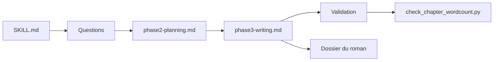

# PenglongHuang/chinese-novelist-skill

> Skill Claude Code qui guide l'écriture d'un roman chinois, du questionnaire au manuscrit validé.

## Le problème
Écrire un roman long exige de tenir un plan, des personnages et une cohérence sur des dizaines de chapitres, et les sessions d'agent perdent ce fil.

## Ce que ça fait vraiment
Un flux en phases : initialisation (préférences mémorisées dans `user-preferences.json`, reprise après interruption), questions en trois niveaux, planification (plan en sept colonnes, fiches personnages, plan d'écriture JSON), choix du mode (série, sous-agents parallèles, Agent Teams), rédaction chapitre par chapitre (3000 à 5000 caractères), puis validation (script `check_chapter_wordcount.py`, cohérence, réécriture jusqu'à 3 fois).

## Comment c'est branché


## Essayer
```bash
npx skills add PenglongHuang/chinese-novelist-skill
```
Puis : `使用 chinese-novelist 帮我写一部小说`.

## Coût et pièges
Le skill lui-même est gratuit ; la rédaction consomme les jetons de l'agent utilisé (coût non chiffré dans le README). Le mode Agent Teams suppose Claude Code.

## Ce que ce n'est pas
Pas un outil de relecture ni de traduction : uniquement la création en chinois. La qualité littéraire n'est pas mesurée, seulement la longueur et la cohérence. Mainteneur unique, dépôt de janvier 2026.

## Alternatives
Aucune alternative nommée dans le README.

## Pour toi
Ignorer : hors de ton profil data/IA/MLOps ; seul le schéma de skill en phases (mémoire, reprise, validation) peut servir d'exemple de structure.

