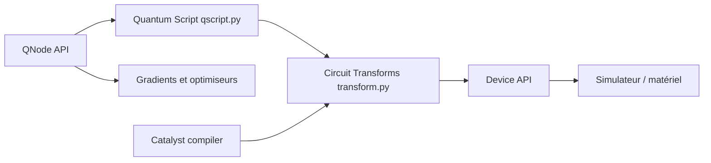

# PennyLaneAI/pennylane

> Bibliothèque Python pour concevoir, différencier et exécuter des circuits quantiques, avec apprentissage automatique hybride.

## Le problème
Écrire des algorithmes quantiques (chimie, optimisation, QML) oblige à jongler entre simulateurs, matériels et calcul de gradients.

## Ce que ça fait vraiment
On décrit des opérations et mesures dans un QNode ; elles sont mises en file dans un script quantique, transformées (compilation), puis exécutées sur un simulateur (Lightning, GPU) ou du matériel. Des transformations de gradient et des optimiseurs servent à l'entraînement. Des modules de chimie, d'estimation de ressources, de jeux de données et de dessin de circuits complètent l'ensemble ; le compilateur Catalyst est cité.

## Comment c'est branché


## Essayer
```bash
python -m pip install pennylane
```

## Coût et pièges
Python 3.12 minimum. Les simulateurs GPU et les accès matériel dépendent de plugins et de comptes chez les fournisseurs, non détaillés dans le README. 433 issues ouvertes.

## Ce que ce n'est pas
Ce n'est pas un ordinateur quantique : les simulations classiques plafonnent vite avec le nombre de qubits. Le README est un texte de présentation ; les affirmations sur la communauté et la vitesse ne sont pas étayées.

## Alternatives
Aucune alternative n'est citée dans le README.

## Pour toi
À surveiller : mature (2018) et actif, utile seulement si tu explores le QML ou l'optimisation quantique ; sans besoin précis, rien à en tirer.
