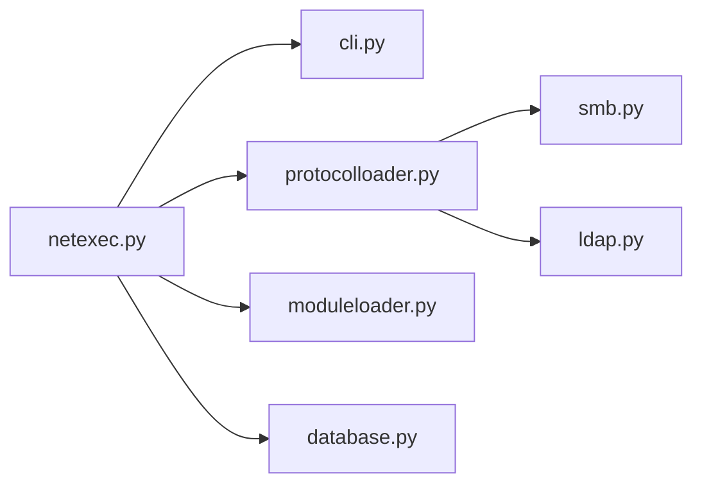

# Pennyw0rth/NetExec

> Outil en ligne de commande d'évaluation de réseaux d'entreprise, pour pentesteurs et équipes défensives autorisées.

## Le problème
Évaluer la sécurité d'un parc de machines et de services (Windows, annuaires, partages) demande de multiplier les outils par protocole.

## Ce que ça fait vraiment
NetExec est la suite communautaire de CrackMapExec (créé en 2015, repris sous ce nom en septembre 2023). L'utilisateur fournit cibles, identifiants, protocole et modules optionnels ; l'outil charge le gestionnaire de protocole (SMB, LDAP, autres) et les modules, puis affiche les résultats en console et conserve un état par protocole dans des bases par espace de travail. Le flux d'appel exact n'est pas visible dans les extraits analysés : non documenté ici.

## Comment c'est branché


## Essayer
```bash
sudo apt install pipx git
pipx ensurepath
pipx install git+https://github.com/Pennyw0rth/NetExec
```
Le README renvoie au wiki (en cours d'écriture) pour l'installation détaillée et les exemples.

## Coût et pièges
Gratuit. Documentation encore en chantier, 165 issues ouvertes. À n'utiliser que sur des systèmes dont on est responsable ou avec une autorisation explicite : les actions sur les services distants peuvent être illégales sans accord.

## Ce que ce n'est pas
Ce n'est pas un outil de supervision ni un scanner passif : il s'authentifie et interagit avec les services distants. Ce n'est pas non plus le dépôt historique CrackMapExec, dont il est la continuation.

## Alternatives
- CrackMapExec : ancêtre cité par le README, désormais remplacé par ce dépôt.

## Pour toi
Surveiller : outil de test d'intrusion Active Directory sans usage dans un pipeline data/IA ; pertinent seulement si tu audites ton propre environnement avec mandat.

