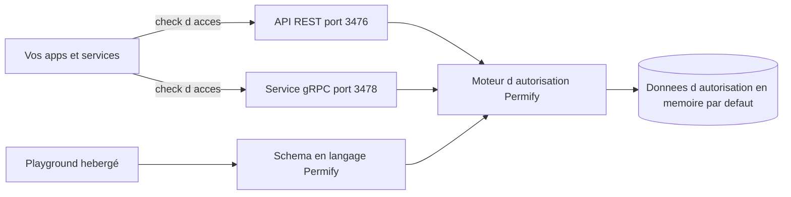

# Permify/permify

> **A standalone fine-grained authorization service, Zanzibar-inspired, for multi-tenant applications.**

## The problem

Without it, permission rules stay scattered across each service's business code: hard to read,
hard to test, and inconsistent when answering "can this user view this document?". The README
states centralizing that logic as the pain it addresses.

## What it actually does

It is a standalone service answering access checks at runtime from any of your applications.
It exposes a REST API (port 3476) and a gRPC service (port 3478). Permissions are described in
the project's own domain-specific language, presented as compatible with RBAC, ReBAC and ABAC,
and authorization logic can be isolated per tenant. Authorization data is stored — in memory by
default in the quickstart mode. The README also documents a `/healthz` health endpoint and
points to a hosted playground to model and test with sample data.

## How it is wired



The README does not describe the internal code architecture: this diagram only reflects what it
names explicitly — two call surfaces, a schema written in the in-house language, a relation
store, and an external playground for modeling.

## Trying it

```shell
docker run -p 3476:3476 -p 3478:3478 ghcr.io/permify/permify serve
```

```shell
localhost:3476/healthz
```

These are the only two commands present in the README; deployment options are deferred to the
online documentation.

## Cost and traps

Docker is enough to start, with no API key or account. Two traps. First the model: the Community
Edition ships only four times a year, and so-called premium features (observability dashboards,
data synchronization) are reserved for the paid cloud, billed on monthly active users. Second
the AGPL-3.0 license, a network copyleft that constrains service usage. Also, the quickstart
keeps data in memory: nothing is persisted as-is. Note that the README announces Permify's
acquisition by FusionAuth, which weighs on the open source project's trajectory.

## What it is not

It is not an identity provider: Permify answers "is it allowed?", not "who is this?" —
authentication stays on your side. It is not a library you import into your code, it is a
separate service to host and operate, with the network latency and availability that implies.
And the self-hosted edition is not the full offering: it is deliberately stripped of certain
features, as the README states plainly.

## Alternatives

The README names no competitor, only the Google Zanzibar paper it draws from. Among the catalog
neighbours: authzed/spicedb and openfga/openfga are two other Zanzibar-inspired implementations
— compare on license and governance; cerbos/cerbos targets declarative policy-based
authorization without a relation graph, simpler if your permissions are not relational.

## For you

Worth a look if you expose data or models to several customers and access rules are starting to
scatter across services. For more classic data/ML work, a separate authorization server is one
more piece of infrastructure to operate. The FusionAuth acquisition and the AGPL license justify
watching rather than adopting right away.
