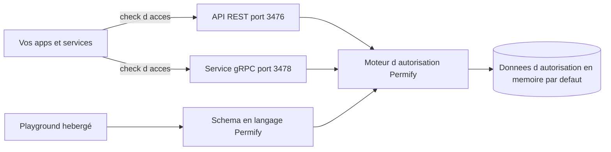

# Permify/permify

> **Serveur d'autorisation fine externalisé, inspiré de Google Zanzibar, pour applications multi-tenants.**

## Le problème

Sans lui, les règles de permission restent éparpillées dans le code métier de chaque service :
impossible de les relire, de les tester ou de répondre de façon homogène à « cet utilisateur
peut-il voir ce document ? ». Le README pose explicitement la centralisation de cette logique
comme la douleur à traiter.

## Ce que ça fait vraiment

C'est un service autonome qui répond en runtime à des vérifications d'accès venant de
n'importe quelle application. Il expose une API REST (port 3476) et un service gRPC (port 3478).
On y décrit ses permissions dans un langage dédié au dépôt, présenté comme compatible RBAC,
ReBAC et ABAC, et on peut définir des logiques d'autorisation isolées par tenant. Les données
d'autorisation sont stockées — par défaut en mémoire dans le mode de démarrage rapide. Le
README documente aussi un endpoint de santé `/healthz` et renvoie vers un playground hébergé
pour modéliser et tester avec des données d'exemple.

## Comment c'est branché



Le README ne décrit pas l'architecture interne du code : ce schéma ne reprend que ce qu'il
nomme explicitement — deux surfaces d'appel, un schéma d'autorisation écrit dans le langage
maison, un stockage des relations, et un playground externe pour modéliser.

## Essayer

```shell
docker run -p 3476:3476 -p 3478:3478 ghcr.io/permify/permify serve
```

```shell
localhost:3476/healthz
```

Ce sont les deux seules commandes présentes dans le README ; les options de déploiement
renvoient à la documentation en ligne.

## Coût et pièges

Docker suffit pour démarrer, sans clé d'API ni compte. Deux pièges à connaître. D'abord le
modèle : la Community Edition est publiée quatre fois par an seulement, et des fonctions dites
premium (tableaux de bord d'observabilité, synchronisation de données) sont réservées au cloud
payant, facturé selon le nombre d'utilisateurs actifs mensuels. Ensuite la licence AGPL-3.0,
copyleft réseau, qui contraint un usage en service. Enfin, le démarrage rapide garde les données
en mémoire : rien n'est persisté tel quel. À noter, le README annonce le rachat de Permify par
FusionAuth, ce qui pèse sur la trajectoire du projet open source.

## Ce que ce n'est pas

Ce n'est pas un fournisseur d'identité : Permify répond à « a-t-il le droit ? », pas à
« qui est-ce ? » — l'authentification reste chez vous. Ce n'est pas une bibliothèque à importer
dans votre code, c'est un service séparé à héberger et à exploiter, avec la latence réseau et
la disponibilité que cela implique. Et l'édition auto-hébergée n'est pas l'offre complète :
elle est volontairement amputée de certaines fonctions, le README le dit sans détour.

## Alternatives

Le README ne cite aucun concurrent, seulement le papier Google Zanzibar dont il s'inspire.
Parmi les voisins du catalogue : authzed/spicedb et openfga/openfga sont deux autres
implémentations inspirées de Zanzibar — à comparer sur la licence et la gouvernance ;
cerbos/cerbos vise plutôt une autorisation par politiques déclaratives sans graphe de relations,
plus simple si vos permissions ne sont pas relationnelles.

## Pour toi

Intéressant si vous exposez des données ou des modèles à plusieurs clients et que les règles
d'accès commencent à se disperser dans les services. Pour un usage data/ML plus classique, un
serveur d'autorisation séparé est une pièce d'infrastructure de plus à exploiter. Le rachat par
FusionAuth et la licence AGPL justifient un statut de surveillance plutôt qu'une adoption
immédiate.
