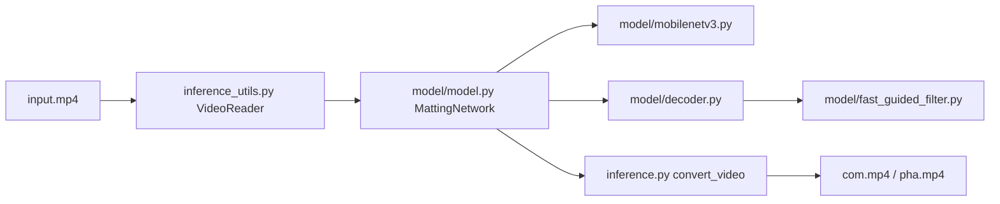

# PeterL1n/RobustVideoMatting

> Modèle de détourage vidéo humain temps réel, récurrent, issu d'un papier ByteDance.

## Le problème
Détourer une personne dans une vidéo sans fond vert ni image de référence, image par image, donne un résultat qui scintille et reste lent.

## Ce que ça fait vraiment
Réseau `MattingNetwork` (backbone MobileNetV3 ou ResNet50, LR-ASPP, décodeur, guided filter) avec états récurrents qui gardent la mémoire temporelle entre images. API `convert_video` pour produire composition, alpha et premier plan. Poids exportés en PyTorch, TorchScript, ONNX, TensorFlow, TF.js et CoreML. Mesuré à 104 FPS en HD sur GTX 1080 Ti (débit tenseur seul).

## Comment c'est branché


## Essayer
```bash
pip install -r requirements_inference.txt
```
(Le reste de l'usage est en Python : `MattingNetwork`, `convert_video` ou `torch.hub.load("PeterL1n/RobustVideoMatting", "mobilenetv3")`.)

## Coût et pièges
GPU recommandé ; le script de conversion fourni est bien plus lent que les chiffres annoncés (pas d'encodage matériel). Licence GPL-3.0 : contraignante pour un produit.

## Ce que ce n'est pas
Pas un détourage générique d'objets : conçu pour les humains. Dernier push en avril 2024, projet de recherche figé.

## Alternatives
Aucune alternative nommée ; seuls des portages tiers (NCNN Android, lite.ai.toolkit, MNN, TNN) sont cités.

## Pour toi
À surveiller : modèle solide et exportable pour un besoin vidéo ponctuel, mais hors cœur data/MLOps, sans évolution depuis 2024 et sous GPL, donc à éviter dans un produit fermé.
