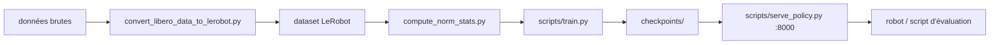

# Physical-Intelligence/openpi

> Modèles vision-langage-action ouverts pour la robotique, avec checkpoints préentraînés et fine-tuning.

## Le problème
Entraîner une politique robotique depuis zéro demande des milliers d'heures de données de robots
que presque personne ne possède.

## Ce que ça fait vraiment
Trois modèles : π₀ (VLA par flow matching), π₀-FAST (autorégressif, tokenizer d'actions FAST) et
π₀.₅ (meilleure généralisation en monde ouvert, entraîné par knowledge insulation). Les checkpoints
de base sont préentraînés sur plus de 10 000 heures de données robot ; des checkpoints « experts »
existent pour DROID, ALOHA et LIBERO. Le dépôt fournit la conversion de données vers le format
LeRobot, le calcul des statistiques de normalisation, l'entraînement JAX et PyTorch, et un serveur
de politique interrogeable par websocket.

## Comment c'est branché


## Essayer
```bash
git clone --recurse-submodules git@github.com:Physical-Intelligence/openpi.git
GIT_LFS_SKIP_SMUDGE=1 uv sync
GIT_LFS_SKIP_SMUDGE=1 uv pip install -e .
uv run scripts/compute_norm_stats.py --config-name pi05_libero
XLA_PYTHON_CLIENT_MEM_FRACTION=0.9 uv run scripts/train.py pi05_libero --exp-name=my_experiment --overwrite
uv run scripts/serve_policy.py policy:checkpoint --policy.config=pi05_libero --policy.dir=checkpoints/pi05_libero/my_experiment/20000
```

## Coût et pièges
GPU NVIDIA obligatoire : >8 Go pour l'inférence, >22,5 Go pour du LoRA, >70 Go (A100/H100) pour du
fine-tuning complet. Ubuntu 22.04 uniquement, pas d'entraînement multi-nœuds. Le patch PyTorch
copie des fichiers dans `transformers` et, en mode hardlink d'uv, contamine durablement le cache uv
— il faut `uv cache clean transformers` pour annuler. Les checkpoints se téléchargent depuis
`gs://openpi-assets`.

## Ce que ce n'est pas
Les auteurs le disent : c'est une expérimentation, π₀ a été développé pour leurs propres robots et
peut ne pas marcher sur le tien. Les checkpoints experts viennent de jeux de données restreints et
ne généralisent pas nécessairement à ton montage. La précision mixte n'est pas encore gérée côté
PyTorch.

## Alternatives
Aucun projet concurrent nommé ; LeRobot est utilisé comme format de données, pas comme alternative.

## Pour toi
Hors périmètre sauf projet robotique ; l'intérêt transverse est le schéma « serveur de politique +
client », transposable à toute inférence lourde déportée.
