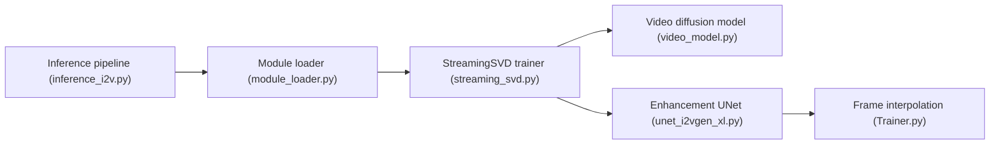

# Picsart-AI-Research/StreamingT2V

> Code de recherche qui génère de longues vidéos cohérentes à partir d'une image, en étendant SVD de façon autorégressive.

## Le problème
Les modèles vidéo courants produisent des clips courts ; allonger une vidéo en gardant cohérence et mouvement est difficile.

## Ce que ça fait vraiment
- StreamingSVD : génération image vers vidéo autorégressive, jusqu'à 200 frames, puis amélioration et interpolation de frames.
- Mélange aléatoire (randomized blending) optionnel entre blocs.
- Fournit la métrique MAWE et renvoie vers StreamingModelscope.
- Accepté à CVPR 2025 selon le README ; poids sur Hugging Face.

## Comment c'est branché


## Essayer
```bash
git clone https://github.com/Picsart-AI-Research/StreamingT2V.git
cd StreamingT2V/
virtualenv -p python3.9 venv
source venv/bin/activate
pip install -r requirements.txt
cd code
python inference_i2v.py --input $INPUT --output $OUTPUT
```

## Coût et pièges
60 Go de VRAM par défaut pour 200 frames ; 24 Go avec `--use_memopt`, environ 50 % plus lent. CUDA 11.8 minimum, Python 3.9, FFmpeg. Pas de licence déclarée ; dernier push mars 2025. La version texte vers vidéo de StreamingSVD figure dans les plans futurs.

## Ce que ce n'est pas
Pas un service ni un modèle prêt pour la production ; sans licence, réutilisation incertaine.

## Alternatives
Le README cite SVD et I2VGen-XL comme bases ou méthodes voisines.

## Pour toi
À surveiller : référence de recherche sur la vidéo longue, mais matériel très exigeant et statut juridique flou.

