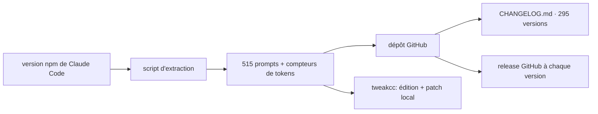

# Piebald-AI/claude-code-system-prompts

> Catalogue à jour des prompts système de Claude Code, avec compteurs de tokens et changelog.

## Le problème
Claude Code n'a pas un prompt système unique mais des centaines de chaînes conditionnelles noyées
dans un gros fichier JS minifié — impossible à lire à la main.

## Ce que ça fait vraiment
Le dépôt liste 515 prompts extraits par script depuis la version npm de Claude Code, avec leur
compte de tokens, à jour de la v2.1.278. Il fournit aussi un CHANGELOG.md couvrant 295 versions
depuis la v2.0.14, mis à jour dans les minutes qui suivent chaque release. Les prompts sont classés :
sous-agents (Explore, Plan), assistants de création (CLAUDE.md, statusline), commandes slash
(`/code-review` en dix parties, `/security-review`, `/schedule`, `/simplify`), utilitaires (résumé
de conversation, classificateur d'état d'agent, moniteur de sécurité, génération de titre) et
données de référence embarquées.

## Comment c'est branché

## Essayer
Aucune commande n'est documentée : le dépôt se lit, il ne s'installe pas. Pour modifier les prompts
de sa propre installation, le README renvoie à l'outil tiers tweakcc, qui édite les prompts en
fichiers markdown puis patche l'installation npm ou binaire, avec gestion des conflits.

## Coût et pièges
Gratuit. Le contenu est extrait du code compilé, donc conforme à ce que Claude Code utilise, mais
certains prompts contiennent des parties interpolées — les compteurs réels en session diffèrent,
sans doute de moins de ±20 tokens. Le dépôt sert aussi de vitrine au produit commercial Piebald.

## Ce que ce n'est pas
Ce n'est pas de la documentation officielle Anthropic, ni un outil : c'est une extraction tenue à
jour par un tiers. Ce n'est pas non plus un moyen de modifier Claude Code — cela passe par tweakcc,
un projet distinct.

## Alternatives
Le README cite tweakcc pour éditer et patcher les prompts localement ; aucun catalogue concurrent
n'est nommé.

## Pour toi
Une mine si tu écris tes propres prompts d'agent : lire comment sont formulés `/code-review`, le
moniteur de sécurité ou le classificateur d'état vaut plusieurs articles de blog.
