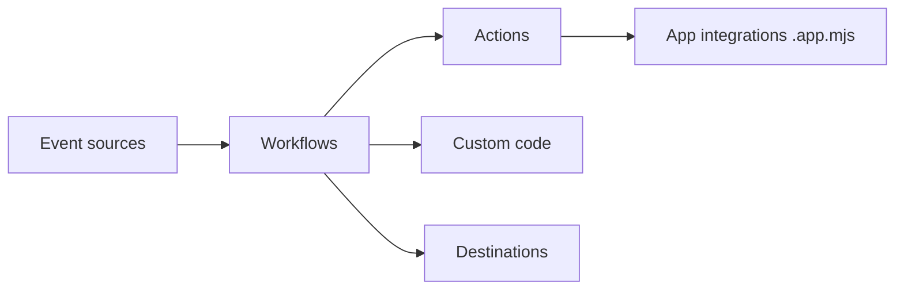

# PipedreamHQ/pipedream

> Plateforme d'intégration événementielle avec composants prêts à l'emploi, pour développeurs qui relient des applications.

## Le problème
Relier des applications SaaS et réagir à leurs événements exige beaucoup de code d'authentification et de plomberie.

## Ce que ça fait vraiment
Workflows : suites d'étapes (actions ou code Node.js, Python, Go, Bash) déclenchées par un événement. Sources d'événements, actions, destinations (S3, Snowflake, HTTP, email, SSE). Le dépôt contient surtout les composants d'intégration (plus de 1 000 apps annoncées), la feuille de route et la documentation ; le moteur de workflow n'y figure pas.

## Comment c'est branché


## Essayer
```javascript
export default {
  name: "http",
  version: "0.0.1",
  props: { http: "$.interface.http" },
  run(event) { console.log(event); },
};
```

## Coût et pièges
Offre gratuite avec limites d'exécution, puis paliers payants. Le moteur est hébergé par Pipedream. Licence non identifiée par GitHub. Le README cite à la fois 1 000+ et 500+ intégrations.

## Ce que ce n'est pas
Ce n'est pas auto-hébergeable d'après ce README : le dépôt contient les composants, pas la plateforme.

## Alternatives
Non documenté : le README ne nomme pas d'alternative.

## Pour toi
Surveiller : pratique pour relier rapidement des services à un pipeline de données ; tu dépends d'une plateforme hébergée et d'une licence à vérifier.

