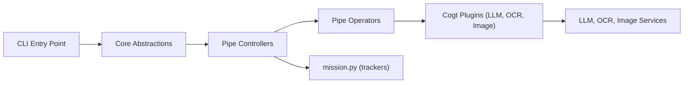

# Pipelex/pipelex

> Langage déclaratif et CLI Python pour définir des pipelines LLM typés et rejouables, pour développeurs d'IA.

## Le problème
Les enchaînements de prompts codés à la main sont peu reproductibles, mal typés et difficiles à partager entre modèles.

## Ce que ça fait vraiment
On décrit des « méthodes » dans des fichiers `.mthds` (TOML) : pipes LLM, extraction OCR, séquences, batch, avec concepts typés. Pipelex route vers plus de 60 modèles, parse les sorties structurées et orchestre. Le même fichier tourne en CLI, Python, API REST, MCP ou n8n.

## Comment c'est branché


## Essayer
```bash
npm install -g mthds
mthds-agent bootstrap
pipelex init
pipelex doctor
uv tool install pipelex
pipelex run bundle cv_batch_screening.mthds --inputs inputs.json
```

## Coût et pièges
Clés d'API de vos fournisseurs, ou Pipelex Gateway (crédits gratuits, une clé), ou modèles locaux (Ollama, vLLM…). Le Gateway remonte des données techniques (noms de modèles, tokens, latence), pas les prompts ; on le désactive en passant par ses propres clés.

## Ce que ce n'est pas
Pas un framework d'agents autonomes : la structure est déclarée par vous. Le runner hébergé `api.pipelex.com` est en bêta privée. La licence n'est pas reconnue par GitHub.

## Alternatives
Aucune alternative citée dans le README.

## Pour toi
À surveiller : l'idée de pipelines typés et versionnés parle aux équipes MLOps, mais la licence doit être lue avant tout usage en entreprise.
