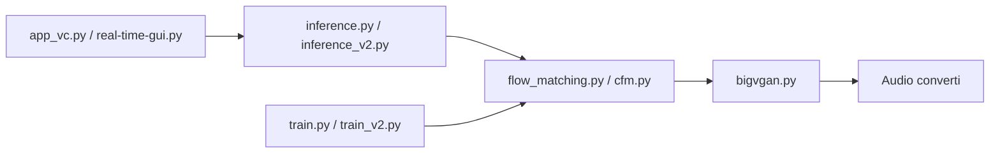

# Plachtaa/seed-vc

> Conversion de voix et de chant en zero-shot, temps réel possible, à partir de 1 à 30 secondes de référence.

## Le problème
Cloner ou convertir une voix demande d'ordinaire un entraînement long par locuteur.

## Ce que ça fait vraiment
Convertit une parole source vers la voix d'un audio de référence, sans entraînement. Quatre modèles : v1 temps réel (25M), v1 hors ligne, v1 chant (44,1 kHz), v2 voix et accent. Fine-tuning possible dès un énoncé par locuteur. Latence annoncée : ~300 ms d'algorithme plus ~100 ms côté appareil.

## Comment c'est branché


## Essayer
```bash
pip install -r requirements.txt
python inference.py --source <source-wav> --target <referene-wav> --output <output-dir> --diffusion-steps 25
python app_vc.py --checkpoint <path-to-checkpoint> --config <path-to-config> --fp16 True
python real-time-gui.py --checkpoint-path <path-to-checkpoint> --config-path <path-to-config>
```

## Coût et pièges
GPU fortement recommandé pour le temps réel (mesures sur RTX 3060 portable). Poids téléchargés depuis Hugging Face au premier lancement.

## Ce que ce n'est pas
Pas un produit maintenu : dépôt archivé, dernier push en avril 2025. Usage d'usurpation de voix : cadre légal à ta charge.

## Alternatives
Le README compare avec RVC et SoVITS (voir EVAL.md).

## Pour toi
Intéressant pour prototyper de la voix, mais archivé et copyleft : surveiller, ne pas bâtir dessus.

