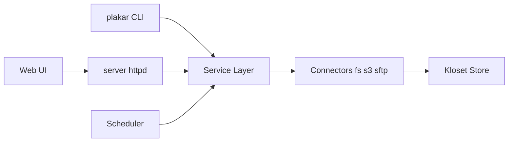

# PlakarKorp/plakar

> Moteur de sauvegarde open source chiffré, dédupliqué et vérifiable, en CLI et interface web.

## Le problème
Sauvegarder fichiers, bases et objets avec chiffrement, déduplication et vérification sans dépendre d'un fournisseur.

## Ce que ça fait vraiment
Crée des instantanés dans un dépôt Kloset immuable, chiffré (données et métadonnées) et dédupliqué. Les instantanés se parcourent, se comparent, se vérifient sans restauration et se restaurent fichier par fichier. Intégrations installables (`plakar pkg add`) pour PostgreSQL, MySQL, etcd, Kubernetes, S3. Archives `.ptar` et synchronisation entre dépôts.

## Comment c'est branché


## Essayer
```bash
go install github.com/PlakarKorp/plakar@latest
plakar at /var/backups create
plakar at /var/backups backup /etc
plakar at /var/backups ls
plakar at /var/backups restore -to /tmp/restore <snapshot-id>
plakar at /var/backups ui
```

## Coût et pièges
Gratuit. Go 1.23.3 ou plus pour compiler. Perte de clé de chiffrement = perte des sauvegardes (non détaillé dans le README).

## Ce que ce n'est pas
Pas un service cloud : tu fournis le stockage. Les intégrations bases de données passent par des paquets à ajouter.

## Alternatives
Aucune alternative nommée dans le README.

## Pour toi
À surveiller : utile pour sauvegarder datasets et bases avec vérification, mais teste la restauration avant de t'y fier.

