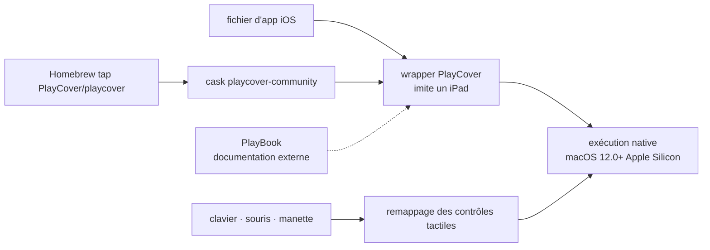

# PlayCover/PlayCover

> **A macOS app that runs iOS apps on Apple Silicon Macs with keyboard, mouse and controller.**

## The problem

Apple Silicon Macs can execute iOS code, yet most iOS games and apps are never shipped for
macOS, and the ones installed through sideloading are driven by touch alone — which on a Mac
means a trackpad pretending to be fingers. The README names Sideloadly as the alternative
sideloading route that specifically cannot remap touch controls onto a keyboard.

## What it actually does

PlayCover puts the iOS application through a wrapper that imitates an iPad; the application
then runs natively on the machine, with no emulation layer. That mechanism is what the README
describes, and it is the core of what the project itself does.

On top of it sits a layer that maps touch controls to keyboard and mouse. The README lists
WASD, camera movement, left and right clicks and individual key mapping, and compares itself
explicitly to the keymapping system of the Android emulator Bluestacks. Controller support is
announced in the project description, without further detail.

The project was originally written to run Genshin Impact on Apple Silicon and was later
widened to a broader range of applications. The README states that not all games are supported
and that some have bugs — a limit the authors declare themselves. Usage documentation lives in
a separate repository (PlayBook), translations are handled on Weblate, and support runs through
a Discord server.

## How it is wired



No code-derived diagram exists for this repository: the chart above is rebuilt from the README
alone, which names no source file. The credited third-party libraries — `inject`,
`PTFakeTouch`, `DownloadManager`, `DataCache`, `CachedAsyncImage` — hint at where binary
injection, touch simulation and downloading happen, but the README does not say how they fit
together.

## Trying it

The README documents exactly one command, installation through the project's own Homebrew tap:

```sh
brew install --cask PlayCover/playcover/playcover-community
```

Uninstalling takes two steps:

```sh
brew uninstall --cask playcover-community
brew untap PlayCover/playcover
```

The other routes are links rather than commands: stable binaries are published in the GitHub
releases, and building from source is deferred to the PlayBook documentation, not reproduced
here.

## Cost and traps

- **Hardware is imposed**: Apple Silicon only (M1 and later) and macOS 12.0 or newer. The
  README is explicit — on an Intel Mac it points to Bootcamp or emulators instead.
- **Free, no account, no key**: nothing in the README points to a paid service, a quota or a
  sign-up. The cost sits elsewhere — you must source the iOS applications yourself.
- **GPLv3 license**: strong copyleft. Embedding or deriving from this code forces redistribution
  under the same terms; that is the alert kept on this card.
- **Partial compatibility, openly stated**: "not all games are supported, and some may have
  bugs". No compatibility list is given in the README; it lives outside the repository.
- **Grey area of use**: running an iOS app outside its intended environment may conflict with a
  publisher's terms of service. The README does not address this.
- **Documentation outside the repository**: install, build and usage all defer to PlayBook and
  Discord. The README on its own is not enough to get running.

## What it is not

- **Not an emulator.** The wrapper makes the application believe it runs on an iPad; the code
  executes natively on the Apple Silicon chip. Nothing is translated, which is exactly why it
  cannot work on an Intel Mac.
- **Not an app store**: PlayCover neither supplies nor downloads iOS apps, it wraps them.
  Obtaining the files is left to the user and the README says nothing about it.
- **Not a guarantee that a given title works**: support is partial, and the project says so.
- **Not a library you import**: it is a macOS application with a user interface, not a reusable
  component for another program.

## Alternatives

No comparable alternative in the catalogue: the batch line lists no neighbours, and the only
competing names the README mentions — Sideloadly (sideloading without keyboard remapping),
Bootcamp and emulators for Intel Macs, and Bluestacks as an Android-side point of comparison
for keymapping — are not GitHub repositories named in the README. The repositories the README
does name (`paradiseduo/inject`, `Ret70/PTFakeTouch`, `shapedbyiris/download-manager`,
`huynguyencong/DataCache`, `bullinnyc/CachedAsyncImage`) are libraries used by the project, not
substitutes for it.

## For you

Ignore it in a data / AI / MLOps context: this is a consumer gaming tool for Apple Silicon
Macs, unrelated to any data or model workflow. The only indirect interest is technical and
marginal — the choice to present an iPad environment rather than emulate one is a clean example
of compatibility at zero execution cost. If you own an M-series Mac and want to run an iOS
game, it is relevant; otherwise, walk past.
