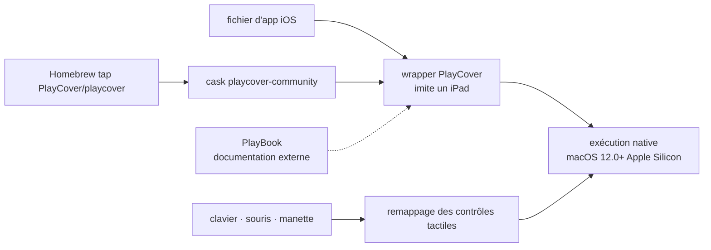

# PlayCover/PlayCover

> **Application macOS qui lance des apps iOS sur Mac Apple Silicon avec clavier, souris et manette.**

## Le problème

Les Mac à puce M-series savent exécuter du code iOS, mais la plupart des jeux et applications
iOS ne sont pas distribués pour macOS, et ceux qu'on installe par des méthodes de chargement
latéral se pilotent uniquement au toucher : sur un Mac, cela signifie un trackpad qui simule
des doigts. Le README cite nommément Sideloadly comme méthode alternative qui, elle, ne permet
pas de remapper les contrôles tactiles vers le clavier.

## Ce que ça fait vraiment

PlayCover fait passer l'application iOS par un *wrapper* qui imite un iPad ; l'application
tourne alors nativement sur la machine, sans couche d'émulation. C'est le mécanisme décrit par
le README, et c'est l'essentiel de ce que le projet fait lui-même.

Par-dessus, il ajoute une couche de remappage des contrôles tactiles vers le clavier et la
souris : le README énumère WASD, le déplacement de caméra, les clics gauche et droit et le
remappage touche par touche, et se compare explicitement au système de keymapping de
l'émulateur Android Bluestacks. Le support manette est annoncé dans la description du projet,
sans détail.

Le projet a d'abord été écrit pour faire tourner Genshin Impact sur Apple Silicon, puis élargi
à un éventail plus large d'applications. Le README précise que tous les jeux ne sont pas pris
en charge et que certains présentent des bugs — c'est la limite annoncée par les auteurs
eux-mêmes. La documentation d'usage vit dans un dépôt séparé (PlayBook), les traductions sont
gérées sur Weblate, et l'assistance passe par un serveur Discord.

## Comment c'est branché



Aucun diagramme tiré du code n'existe pour ce dépôt : ce schéma est reconstruit depuis le seul
README, qui ne nomme aucun fichier source. Les bibliothèques tierces créditées — `inject`,
`PTFakeTouch`, `DownloadManager`, `DataCache`, `CachedAsyncImage` — indiquent où passent
respectivement l'injection dans le binaire, la simulation du toucher et le téléchargement, mais
le README ne dit pas comment elles s'articulent.

## Essayer

Le README ne documente qu'une seule commande, l'installation par le tap Homebrew du projet :

```sh
brew install --cask PlayCover/playcover/playcover-community
```

Désinstallation, en deux temps :

```sh
brew uninstall --cask playcover-community
brew untap PlayCover/playcover
```

Les autres voies sont des liens, pas des commandes : les binaires stables sont publiés dans les
releases GitHub, et la compilation depuis les sources est renvoyée à la documentation PlayBook,
non reproduite ici.

## Coût et pièges

- **Matériel imposé** : Apple Silicon uniquement (M1 et suivantes) et macOS 12.0 ou plus récent.
  Le README est explicite — sur un Mac Intel, il renvoie vers Bootcamp ou des émulateurs.
- **Gratuit, sans compte ni clé** : rien dans le README n'indique un service payant, un quota ou
  une inscription. Le coût est ailleurs : il faut se procurer soi-même les applications iOS.
- **Licence GPLv3** : copyleft fort. Intégrer ou dériver ce code impose de redistribuer sous la
  même licence — c'est l'alerte retenue de cette fiche.
- **Compatibilité partielle assumée** : « not all games are supported, and some may have bugs ».
  Aucune liste de compatibilité n'est donnée dans le README ; elle vit hors du dépôt.
- **Zone grise d'usage** : faire tourner une app iOS hors de son environnement prévu peut
  contrevenir aux conditions d'utilisation de l'éditeur. Le README n'aborde pas le sujet.
- **Documentation hors dépôt** : installation, compilation et usage renvoient à PlayBook et à
  Discord. Le README seul ne suffit pas à mettre l'outil en route.

## Ce que ce n'est pas

- **Ce n'est pas un émulateur.** Le wrapper fait croire à l'application qu'elle tourne sur un
  iPad ; le code s'exécute nativement sur la puce Apple Silicon. Rien n'est traduit, et cela
  explique pourquoi ça ne peut pas fonctionner sur un Mac Intel.
- **Ce n'est pas une boutique d'applications** : PlayCover ne fournit ni ne télécharge les apps
  iOS, il les enveloppe. L'obtention des fichiers est à la charge de l'utilisateur, et le README
  n'en dit rien.
- **Ce n'est pas une garantie de fonctionnement** : la prise en charge est partielle, et le
  projet le dit lui-même.
- **Ce n'est pas une bibliothèque qu'on importe** : c'est une application macOS avec interface,
  pas un composant réutilisable dans un autre programme.

## Alternatives

Aucune alternative comparable dans le catalogue : la ligne du lot ne propose aucun voisin, et
les seuls noms cités par le README comme solutions concurrentes — Sideloadly (chargement
latéral sans remappage clavier), Bootcamp et les émulateurs pour Mac Intel, Bluestacks comme
point de comparaison du keymapping côté Android — ne sont pas des dépôts GitHub nommés dans le
README. Les dépôts que le README cite (`paradiseduo/inject`, `Ret70/PTFakeTouch`,
`shapedbyiris/download-manager`, `huynguyencong/DataCache`, `bullinnyc/CachedAsyncImage`) sont
des bibliothèques utilisées par le projet, pas des solutions de rechange.

## Pour toi

À ignorer dans un contexte data / IA / MLOps : c'est un outil de jeu grand public pour Mac
Apple Silicon, sans rapport avec un flux de travail de traitement de données ou de modèles. Le
seul intérêt indirect est technique et marginal — le parti pris du wrapper qui présente un
environnement iPad plutôt que d'émuler, qui est un exemple propre de compatibilité à coût nul
d'exécution. Si tu as un Mac M-series et un jeu iOS à faire tourner, c'est pertinent ; sinon,
passe ton chemin.
