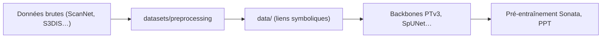

# Pointcept/Pointcept

> Base de code de recherche pour la perception de nuages de points 3D (segmentation, pré-entraînement).

## Le problème
Comparer des architectures 3D (Point Transformer, sparse CNN) sur ScanNet, S3DIS ou nuScenes demande de réimplémenter chargement, augmentations et entraînement pour chacune.

## Ce que ça fait vraiment
Réunit dans un même code les backbones (PTv1-v3, MinkUNet, SpUNet, OA-CNNs, Swin3D…), des méthodes de pré-entraînement (MSC, PPT, Sonata, Concerto, Utonia) et le prétraitement de nombreux jeux (ScanNet, ScanNet++, S3DIS, ArkitScenes, HM3D, Matterport3D, Structured3D). Support CUDA 11.3+ ou ROCm 7. Lecture partielle : la partie « Quick Start », le Model Zoo et le schéma d'architecture n'ont pas pu être lus.

## Comment c'est branché


## Essayer
```bash
conda env create -f environment.yml --verbose
conda activate pointcept-torch2.5.0-cu12.4
docker run --gpus all -it --rm pointcept/pointcept:v1.6.0-pytorch2.5.0-cuda12.4-cudnn9-devel bash
python pointcept/datasets/preprocessing/scannet/preprocess_scannet.py --dataset_root ${RAW_SCANNET_DIR} --output_root ${PROCESSED_SCANNET_DIR}
```

## Coût et pièges
GPU NVIDIA ou AMD obligatoire. Plusieurs jeux exigent un formulaire d'accès ; Structured3D fait 471,7 Go décompressé. Compilation de `libs/pointops` nécessaire pour PTv1/v2. 367 issues ouvertes. Fiche établie sur une lecture tronquée.

## Ce que ce n'est pas
Pas un produit ni une API : du code de recherche à lancer avec des configs. Ne couvre pas la vision 2D.

## Alternatives
Non documenté dans la partie lue du README.

## Pour toi
Surveiller : référence si tu travailles en 3D (LiDAR, scans), sinon hors sujet pour un profil data/MLOps généraliste.
