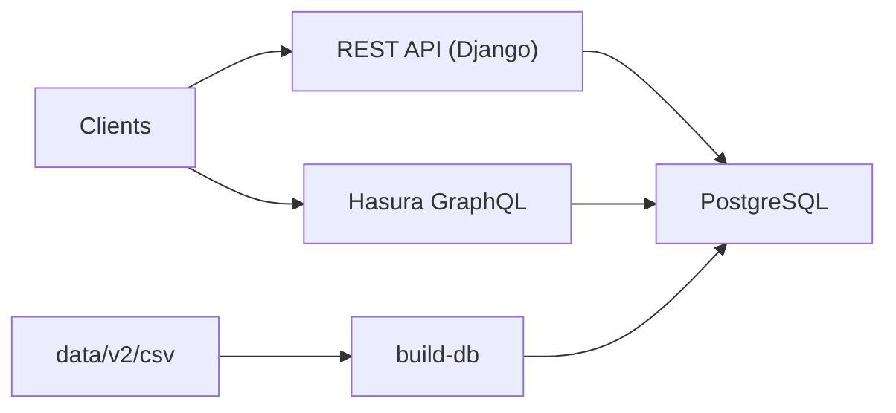

# PokeAPI/pokeapi

> API REST (et GraphQL bêta) de données Pokémon, à héberger soi-même ou à consommer publiquement.

## Le problème
Disposer d'un jeu de données relationnel riche et stable pour apprendre, tester ou faire des démonstrations d'API.

## Ce que ça fait vraiment
Application Django qui sert `/api/v2/` ; la base est reconstruite depuis des CSV (`make build-db`). Docker Compose et manifestes Kubernetes fournissent PostgreSQL et un moteur Hasura pour GraphQL ; en local, le README évoque SQLite. Wrappers officiels dans plusieurs langages.

## Comment c'est branché


## Essayer
```bash
make install
make setup
make serve
make build-db
make docker-setup
```

## Coût et pièges
Gratuit. Cloner avec `--recurse-submodules`. Le service public compte plus d'un milliard de requêtes par mois selon le README : privilégier le cache ou l'hébergement local. Déploiement Kubernetes : volumes de 12 Gi.

## Ce que ce n'est pas
Pas un jeu de données pour l'apprentissage automatique à grande échelle : c'est un référentiel de faits sur le jeu. Le GraphQL reste en bêta.

## Alternatives
Aucune alternative nommée dans le README (les wrappers listés sont des clients).

## Pour toi
À adopter comme source de démonstration ou d'exercice pour API et bases relationnelles ; sans valeur métier autrement.

