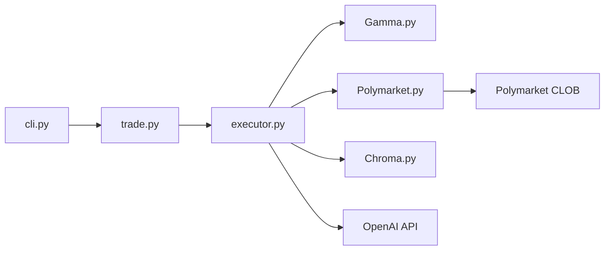

# Polymarket/agents

> Kit Python pour bâtir des agents IA qui parient sur les marchés de prédiction Polymarket.

## Le problème
Relier un LLM, des sources de nouvelles et l'API d'ordres de Polymarket demande beaucoup de colle.

## Ce que ça fait vraiment
Un CLI (`scripts/python/cli.py`) et un point d'entrée `agents/application/trade.py` orchestrent un créateur d'agent, un exécuteur et des prompts. Des connecteurs couvrent l'API Gamma (métadonnées de marchés), l'API Polymarket (ordres signés), Chroma pour le RAG sur des sources d'actualité, et OpenAI. Le tout vise le trading autonome.

## Comment c'est branché


## Essayer
```bash
git clone https://github.com/{username}/polymarket-agents.git
cd polymarket-agents
virtualenv --python=python3.9 .venv
source .venv/bin/activate
pip install -r requirements.txt
cp .env.example .env
python scripts/python/cli.py
```

## Coût et pièges
`.env` demande `POLYGON_WALLET_PRIVATE_KEY` et `OPENAI_API_KEY` : une clé de portefeuille à côté d'un agent autonome est un risque réel. Il faut alimenter le portefeuille en USDC. Les conditions d'utilisation interdisent le trading aux résidents américains et à d'autres juridictions.

## Ce que ce n'est pas
Pas un système de trading éprouvé : aucun résultat chiffré n'est donné. Dépôt archivé, dernier push en novembre 2024, Python 3.9 imposé.

## Alternatives
Aucune alternative n'est citée dans le README (seuls des clients CLOB, LangChain et Chroma sont listés comme dépôts liés).

## Pour toi
À ignorer : archivé, clé privée exposée à un agent, restrictions légales ; garde-le seulement comme exemple de structure agent + RAG + exécution.
