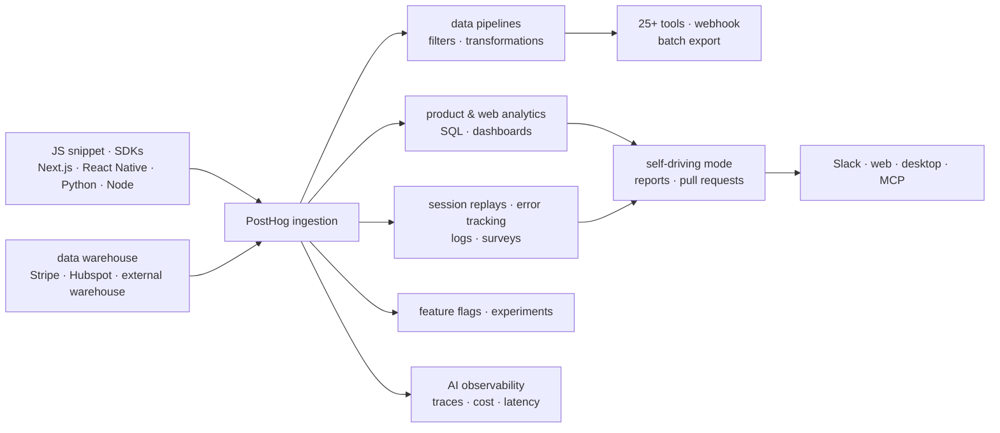

# PostHog/posthog

> **One product platform — analytics, replays, flags, experiments — for teams who want it all in one place.**

## The problem

Measuring a product usually means one tool for analytics, another for session replays, a third
for feature flags, a fourth for errors, a fifth for surveys — each with its own SDK, its own
bill and its own notion of who the user is. Stitching those silos back together to answer "why
did this user drop off?" takes longer than the question deserves.

## What it actually does

PostHog ingests product events through a JavaScript snippet, an SDK or the API, and stores
them so every module reads the same base: product analytics (autocapture or manual
instrumentation, explored through visualizations or SQL), GA-style web analytics, web and
mobile session replays, feature flags, experiments with statistical impact measurement, error
tracking, logs and surveys.

It also pulls outside data in: the data warehouse module syncs Stripe, Hubspot or an external
warehouse so they can be queried alongside product events, and data pipelines filter and
transform the incoming stream before sending it to 25+ tools or any webhook, in real time or
as batch exports.

Two pieces matter directly for AI work: AI observability captures traces, generations, latency
and cost for an LLM-powered app; self-driving mode turns product signals (errors, rage clicks,
failed queries) into researched reports and pull requests you review and merge. All of it is
steered from Slack, the web, a desktop app, or your editor through the MCP — in Claude Code,
Cursor or any MCP-compatible agent.

## How it is wired



No code-derived diagram exists for this repository: this one is rebuilt from the README alone,
from the modules it lists and the data flow it describes. The structuring point is the single
ingestion node — every module reads the same event stream, and that is the whole argument
against running five separate tools.

## Trying it

The README documents exactly one command, the self-hosted hobby deploy on Linux with Docker
(4GB memory recommended):

```bash
/bin/bash -c "$(curl -fsSL https://raw.githubusercontent.com/posthog/posthog/HEAD/bin/deploy-hobby)"
```

The other path, the one the README actually recommends, is not a command: it is signing up for
PostHog Cloud US or EU. Product-side installation then happens through the JavaScript snippet,
an SDK or the API — the README links to the docs rather than showing code. Local development
is deferred to the handbook, outside the README.

## Cost and gotchas

- **Quota-based freemium**: free every month up to 1 million events, 5k recordings, 1M flag
  requests, 100k exceptions and 1500 survey responses; usage-based billing beyond that.
  Generous for a young product, less so for one with traffic.
- **Self-hosting is explicitly capped**: the README states open source deployments scale to
  roughly 100k events per month and recommends migrating to Cloud past that. No customer
  support and no guarantees for open source deployments — stated in as many words.
- **Docker and 4GB of RAM minimum** for the hobby deploy, Linux only.
- **An account is required** on either practical path (Cloud US or Cloud EU).
- **Two licensing regimes**: MIT expat for the repo, *except* the `ee` directory which has its
  own license. The catalogue records `NOASSERTION` — GitHub could not resolve it, precisely
  because of that split. Clear it before internal use; for fully free software the README
  points to `PostHog/posthog-foss`, purged of proprietary code.
- **Region choice sticks**: Cloud US and Cloud EU are separate instances, picked at signup.

## What it is not

- **Not a tool you casually install locally to try out.** The README's recommended path is the
  SaaS; self-hosting is labelled "Advanced", unsupported, and capped around 100k events/month.
  Expecting the same product for free on your own box is the main misunderstanding.
- **Not a data warehouse or a BI tool.** The data warehouse module syncs external sources so
  they can be queried next to product events; it does not replace an analytical warehouse, and
  the README claims no such thing.
- **Not a single-license project**: the `ee` directory is governed separately, and the truly
  FOSS build lives in a different repository.

## Alternatives

| | When to prefer it |
|---|---|
| **PostHog/posthog-foss** | Named in the README: the same product purged of all proprietary code and features. Prefer it when the constraint is legal — a hard 100% free-software requirement — and losing the `ee` features is acceptable. |
| **netdata/netdata** | A catalogue neighbour, comparable only loosely: real-time infrastructure monitoring, not user behaviour. Prefer it for "is my machine healthy?"; PostHog for "is my product any good?". |

The other supplied neighbours (`IBM/mcp-context-forge`, `ongridio/ongrid`,
`strands-agents/samples`) are not comparable: neither product analytics nor usage
observability.

## For you

Adopt, but read it precisely: the piece that matters for a data/AI profile is AI observability
— traces, generations, latency and cost of an LLM app — sitting on the same event stream as
product analytics, so it can be read next to actual user behaviour. That combination is rare,
and it saves adding yet another LLM tracing tool. Walk past it if the need is purely a
warehouse or infrastructure monitoring, and distrust the "we'll just self-host it" reflex:
past 100k events a month the Cloud bill comes back through the window.
