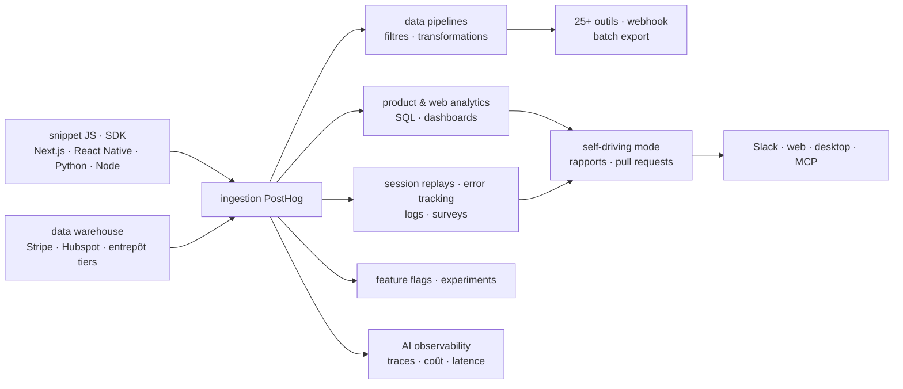

# PostHog/posthog

> **Plateforme produit unique — analytics, replays, drapeaux, expériences — pour une équipe qui veut tout garder au même endroit.**

## Le problème

Mesurer un produit demande d'habitude un outil d'analytics, un autre pour les replays de
session, un troisième pour les drapeaux de fonctionnalité, un quatrième pour les erreurs, un
cinquième pour les sondages — chacun avec son SDK, sa facture et son propre identifiant
d'utilisateur. Recoller ces silos pour répondre à « pourquoi cet utilisateur a abandonné ? »
occupe plus de temps que la question elle-même.

## Ce que ça fait vraiment

PostHog ingère les événements d'un produit via un snippet JavaScript, un SDK ou l'API, et les
stocke pour que tous ses modules lisent la même base : analytics produit (autocapture ou
instrumentation manuelle, exploration en visualisation ou en SQL), web analytics façon GA,
replays de session web et mobile, drapeaux de fonctionnalité, expériences avec mesure
statistique d'impact, suivi d'erreurs, logs, sondages.

Il fait aussi entrer des données extérieures : le *data warehouse* synchronise Stripe, Hubspot
ou un entrepôt tiers pour les requêter à côté des événements produit, et les *pipelines*
filtrent et transforment le flux entrant avant de l'envoyer vers 25+ outils, n'importe quel
webhook, en temps réel ou par export par lots.

Deux briques touchent directement l'IA : l'*AI observability* capture traces, générations,
latence et coût d'une application à base de LLM ; le *self-driving mode* transforme des
signaux du produit (erreurs, rage clicks, requêtes en échec) en rapports documentés et en pull
requests à relire et fusionner. Le tout se pilote depuis Slack, le web, une application de
bureau, ou son éditeur via le MCP — dans Claude Code, Cursor ou tout agent compatible.

## Comment c'est branché



Aucun diagramme tiré du code n'existe pour ce dépôt : ce schéma est reconstruit depuis le seul
README, à partir des modules qu'il énumère et du sens de circulation des données qu'il décrit.
Le point structurant est le nœud d'ingestion unique : tous les modules lisent le même flux
d'événements, c'est là qu'est la valeur par rapport à cinq outils séparés.

## Essayer

Le README ne documente qu'une seule commande, pour le déploiement « hobby » auto-hébergé sur
Linux avec Docker (4 Go de mémoire recommandés) :

```bash
/bin/bash -c "$(curl -fsSL https://raw.githubusercontent.com/posthog/posthog/HEAD/bin/deploy-hobby)"
```

L'autre chemin, celui que le README recommande, n'est pas une commande : c'est l'inscription
sur PostHog Cloud US ou EU. L'installation côté produit se fait ensuite par le snippet
JavaScript, un SDK ou l'API — le README renvoie à la documentation sans donner de ligne de
code. Le développement local est renvoyé au handbook, hors README.

## Coût et pièges

- **Freemium à quota** : gratuit chaque mois jusqu'à 1 million d'événements, 5 000
  enregistrements, 1 million de requêtes de drapeaux, 100 000 exceptions et 1 500 réponses de
  sondage ; au-delà, facturation à l'usage. Les quotas sont généreux pour un produit jeune,
  pas pour un produit à trafic.
- **L'auto-hébergement est explicitement bridé** : le README annonce un plafond d'environ
  100 000 événements par mois pour le déploiement open source, et recommande la migration vers
  le Cloud au-delà. Ni support client ni garantie sur les déploiements auto-hébergés — c'est
  écrit noir sur blanc.
- **Docker et 4 Go de RAM minimum** pour le hobby deploy, sur Linux uniquement.
- **Compte à créer** dans les deux cas pratiques (Cloud US ou EU).
- **Licence en deux régimes** : MIT expat pour le dépôt, *sauf* le répertoire `ee` qui a sa
  propre licence. Le catalogue relève `NOASSERTION` : GitHub n'a pas su trancher, justement à
  cause de cette double licence. À lever avant tout usage interne ; pour du 100 % libre, le
  README renvoie à `PostHog/posthog-foss`, purgé du code propriétaire.
- **Choix de région irréversible en pratique** : Cloud US et Cloud EU sont deux instances
  distinctes, à choisir à l'inscription.

## Ce que ce n'est pas

- **Ce n'est pas un outil qu'on installe pour l'essayer en local sans y penser.** Le chemin
  recommandé par le README est le SaaS ; l'auto-hébergement est étiqueté « Advanced », sans
  support, et plafonné à ~100k événements/mois. Croire qu'on aura le même produit gratuitement
  chez soi est le malentendu principal.
- **Ce n'est pas un entrepôt de données ni un outil de BI.** Le module *data warehouse*
  synchronise des sources externes pour les requêter à côté des événements produit ; il ne
  remplace pas un entrepôt analytique, et le README ne prétend rien de tel.
- **Ce n'est pas un projet sous une licence unique** : le répertoire `ee` est régi séparément,
  et la version réellement FOSS est un autre dépôt.

## Alternatives

| | Quand le préférer |
|---|---|
| **PostHog/posthog-foss** | Nommé dans le README : le même produit purgé de tout code et de toute fonctionnalité propriétaire. À préférer quand la contrainte est juridique — obligation de 100 % libre — et qu'on accepte de perdre les fonctions `ee`. |
| **netdata/netdata** | Voisin du catalogue, comparable seulement de loin : supervision d'infrastructure en temps réel, pas de comportement utilisateur. À préférer si la question est « ma machine va-t-elle bien ? » ; PostHog si la question est « mon produit sert-il à quelque chose ? ». |

Les autres voisins fournis (`IBM/mcp-context-forge`, `ongridio/ongrid`,
`strands-agents/samples`) ne sont pas comparables : ni analytics produit, ni observabilité
d'usage.

## Pour toi

À adopter, avec une lecture précise : la brique qui compte pour un profil data / IA, c'est
l'*AI observability* — traces, générations, latence et coût d'une application LLM — branchée
sur le même flux d'événements que les analytics produit, donc lisible à côté du comportement
réel des utilisateurs. C'est rare, et ça évite d'ajouter un outil de LLM tracing de plus.
Passer son chemin si le besoin est purement un entrepôt ou du monitoring d'infra, et se méfier
du réflexe « on l'auto-héberge » : au-delà de 100k événements par mois, la facture Cloud
revient par la fenêtre.
