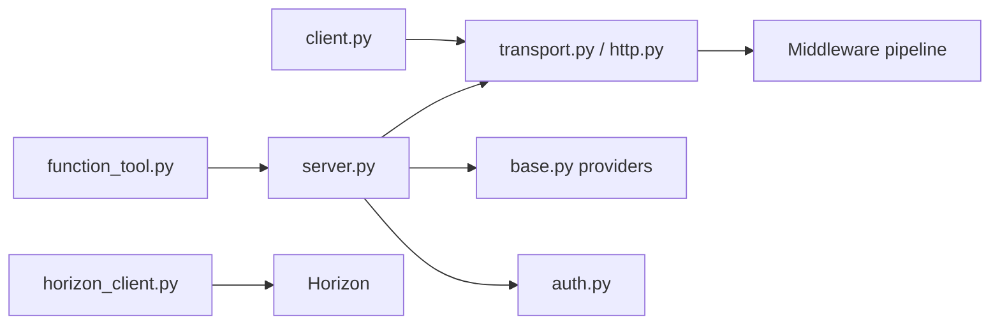

# PrefectHQ/fastmcp

> Framework Python pour écrire serveurs, clients et apps MCP à partir de simples fonctions.

## Le problème
Implémenter le protocole MCP à la main (schémas, transports, authentification, cycle de vie) est long et source d'erreurs.

## Ce que ça fait vraiment
Un décorateur `@mcp.tool` transforme une fonction Python en outil MCP typé (schéma et validation générés).
Serveur : transports stdio/HTTP, middleware (auth, cache, rate limit), providers (local, proxy, OpenAPI), transforms.
Client : découverte, appels, OAuth, handlers de sampling Anthropic/OpenAI/Gemini.
Paquets annexes : CLI distante, tâches durables ; déploiement optionnel vers Horizon (SaaS Prefect).

## Comment c'est branché


## Essayer
```bash
uv add fastmcp
```

## Coût et pièges
Gratuit (Apache-2.0). Horizon est une offre entreprise payante, non requise. Plusieurs versions majeures : suivre les guides de migration.

## Ce que ce n'est pas
Pas le SDK MCP officiel (bien que la v1 y ait été intégrée). Pas une passerelle d'entreprise : c'est le rôle d'Horizon.

## Alternatives
- FastMCP for TypeScript (@prefecthq/fastmcp-ts) : même approche côté Node.

## Pour toi
Adopter : le chemin le plus court pour exposer tes outils data ou tes modèles à Claude via MCP, en quelques lignes de Python.
