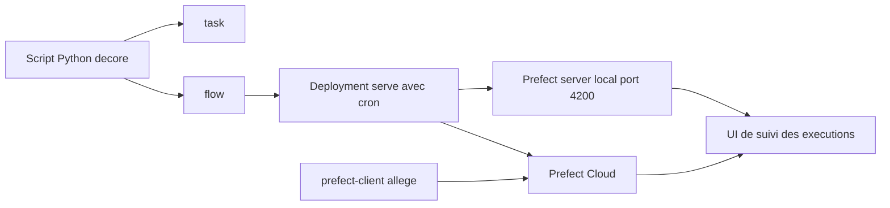

# PrefectHQ/prefect

> **Decorate Python functions to turn a script into a scheduled, tracked, retried pipeline.**

## The problem

Without an orchestrator, a data script running under cron has no history, no recovery after
failure and no visibility: when it breaks at 3 a.m., you find out downstream. Hand-rolling
retries, caching, scheduling and logging around every script means rewriting a scheduler each
time.

## What it actually does

Prefect is a Python workflow orchestration framework for data pipelines. You annotate functions
with `@flow` and `@task`; the framework handles scheduling, caching, retries and event-based
automations. Workflow activity is tracked and can be inspected in a UI backed either by a
self-hosted Prefect server or by managed Prefect Cloud. A flow becomes a deployment via
`.serve(...)` with a `cron` expression, and a local process then waits for scheduled runs; runs
can also be triggered from the UI or the CLI. The README also mentions dependencies and branching
logic without detailing them.

## How it is wired



No code-derived diagram exists for this repository: these nodes are inferred from the README
alone. The business logic stays an ordinary Python script; the `task` and `flow` decorators make
it observable, `serve` publishes it as a deployment, and tracking flows to a backend of your
choice — a self-hosted server on `http://localhost:4200` or Prefect Cloud. The lighter
`prefect-client` package exists only to talk to a remote backend from ephemeral execution
environments.

## Trying it

```bash
pip install -U prefect
```

```bash
uv add prefect
```

```bash
prefect server start
```

Then, as documented in the README, a Python file using `@task` and `@flow`, run directly; the UI
opens at `http://localhost:4200`. To schedule it, the README replaces the final call with
`github_stars.serve(name="first-deployment", cron="* * * * *", parameters=...)`.

## Cost and traps

Python 3.10+ is required. The core is open source and the server is self-hostable, so free — but
the README steadily points to Prefect Cloud, whose feature split against the OSS build is not
documented here (the "cloud-vs-oss" page is linked elsewhere): team collaboration and user
management are presented on the Cloud side. The README says nothing about Cloud pricing, nor about
sizing the self-hosted server or its database. Note also that every README link carries `utm_*`
tracking parameters, and the README uses its own superlatives ("the simplest way",
"confidently") — a sign of a marketing document as much as a technical one.

## What it is not

It is not a compute engine: Prefect schedules and observes, it does not make anything faster and
distributes nothing by itself — the code stays the Python you supply. Nor is it a zero-config
production server: the `serve` example starts a plain local process waiting for runs, which is not
a durable deployment. Finally, the tracking UI assumes a running backend; with neither a server
nor Cloud, the decorators give you no browsable history.

## Alternatives

- **apache/airflow** — the incumbent orchestrator, DAG declared apart from the code; prefer it if
  the operator ecosystem and an existing install matter more than Python ergonomics.
- **dagster-io/dagster** — asset-oriented rather than task-oriented; prefer it if you want to
  reason in produced tables and lineage rather than in runs.
- **Avaiga/taipy** — aimed at building data applications with a UI; off-target if the need is
  purely scheduled orchestration.

## For you

For a data / MLOps profile, this is the cheapest entry point from a fragile cron to pipelines with
retries, caching and history, without leaving Python or rewriting the business code. Adopt it if
your workloads are already Python; look harder if your organisation is already tooled around
Airflow, where migration will cost more than the ergonomic gain.
