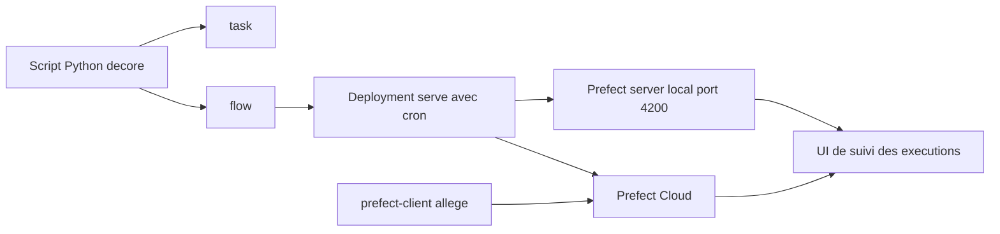

# PrefectHQ/prefect

> **Décorer des fonctions Python pour transformer un script en pipeline planifié, suivi et relancé.**

## Le problème

Sans orchestrateur, un script de données qui tourne en cron n'a ni historique, ni reprise après
échec, ni visibilité : quand il casse à 3 h du matin, on l'apprend par l'aval. Ajouter à la main
retries, cache, planification et journalisation revient à réécrire un ordonnanceur autour de
chaque script.

## Ce que ça fait vraiment

Prefect est un framework Python d'orchestration de pipelines de données. On annote des fonctions
avec `@flow` et `@task` ; le framework prend en charge la planification, le cache, les retries et
les automatisations déclenchées par événements. L'activité des workflows est suivie et consultable
dans une UI, servie soit par un serveur Prefect auto-hébergé, soit par Prefect Cloud. Un flow
devient un *deployment* via `.serve(...)` avec un `cron`, et un processus local reste à l'écoute
des exécutions planifiées ; on peut aussi déclencher depuis l'UI ou la CLI. Le README mentionne
aussi la gestion de dépendances et de branchements conditionnels, sans les détailler.

## Comment c'est branché



Aucun diagramme tiré du code n'est disponible pour ce dépôt : ces nœuds sont déduits du seul
README. La logique métier reste un script Python ordinaire ; les décorateurs `task` et `flow` en
font des objets observables, `serve` les publie comme deployment, et le suivi remonte vers un
backend au choix — serveur auto-hébergé sur `http://localhost:4200` ou Prefect Cloud. Le paquet
`prefect-client`, plus léger, ne sert qu'à dialoguer avec un backend distant depuis un
environnement d'exécution éphémère.

## Essayer

```bash
pip install -U prefect
```

```bash
uv add prefect
```

```bash
prefect server start
```

Puis, tel que documenté dans le README, un fichier Python utilisant `@task` et `@flow`, lancé
directement ; l'UI s'ouvre sur `http://localhost:4200`. Pour planifier, le README remplace
l'appel final par `github_stars.serve(name="first-deployment", cron="* * * * *", parameters=...)`.

## Coût et pièges

Python 3.10+ est exigé. Le cœur est open source et le serveur s'auto-héberge, donc gratuit — mais
le README pousse continûment vers Prefect Cloud, dont le partage de fonctionnalités avec l'OSS
n'est pas documenté ici (le lien « cloud-vs-oss » l'est ailleurs) : la collaboration d'équipe et
la gestion des utilisateurs sont présentées côté Cloud. Le README ne dit rien du coût du Cloud, du
dimensionnement du serveur auto-hébergé ni de sa base de données. À noter aussi : chaque lien du
README porte des paramètres de suivi `utm_*`, et le README emploie ses propres superlatifs
(« the simplest way », « confidently ») — signal de document commercial autant que technique.

## Ce que ce n'est pas

Ce n'est pas un moteur de calcul : Prefect ordonnance et observe, il n'exécute pas plus vite et ne
distribue rien par lui-même — le code reste du Python que vous fournissez. Ce n'est pas non plus un
serveur « zéro configuration » pour la production : l'exemple `serve` lance un simple processus
local qui attend les exécutions, ce qui n'est pas un déploiement durable. Enfin, l'UI de suivi
suppose un backend démarré ; sans serveur ni Cloud, les décorateurs n'offrent pas d'historique
consultable.

## Alternatives

- **apache/airflow** — l'orchestrateur historique, DAG déclaré à part du code ; à préférer si
  l'écosystème d'opérateurs et l'installation déjà en place priment sur l'ergonomie Python.
- **dagster-io/dagster** — orienté actifs de données plutôt que tâches ; à préférer si l'on veut
  raisonner en tables produites et en lignage plutôt qu'en exécutions.
- **Avaiga/taipy** — vise plutôt la construction d'applications de données avec interface ; hors
  sujet si le besoin est purement de l'ordonnancement planifié.

## Pour toi

Pour un profil data / MLOps, c'est le point d'entrée le moins coûteux pour passer d'un cron fragile
à des pipelines avec retries, cache et historique, sans quitter Python ni réécrire le code métier.
À adopter si vos traitements sont déjà en Python ; à regarder de plus près si votre organisation
est déjà outillée Airflow, où la migration coûtera plus que le gain d'ergonomie.
