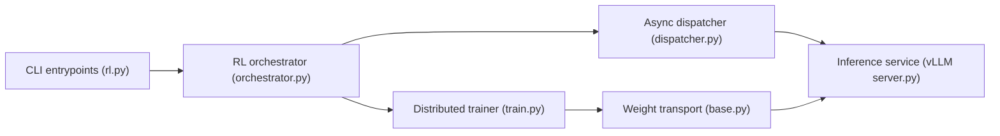

# PrimeIntellect-ai/prime-rl

> Framework de post-entraînement RL asynchrone (SFT, RL, évals) pour LLM, de un GPU à plus de mille.

## Le problème
Entraîner des modèles par RL agentique à grande échelle exige d'orchestrer inférence, génération de trajectoires et entraînement distribué.

## Ce que ça fait vraiment
Un orchestrateur asynchrone distribue la génération (vLLM) et collecte trajectoires et récompenses ; un trainer FSDP2 applique les algos (GRPO, etc.) puis republie les poids via transport filesystem, NCCL ou NIXL. Config par TOML. Cible Slurm et Kubernetes ; environnements `verifiers`. Évals et monitoring (fichier, W&B, dashboard local) inclus.

## Comment c'est branché


## Essayer
```bash
curl -sSL https://raw.githubusercontent.com/PrimeIntellect-ai/prime-rl/main/scripts/install.sh | bash
uv sync --all-extras
uv run sft @ configs/debug/fake/sft.toml
uv run inference --vllm.model Qwen/Qwen3-0.6B
uv run rl @ configs/basic/reverse-text/rl.toml
```

## Coût et pièges
Au moins un GPU NVIDIA (2 pour la pile RL complète), Python 3.12 ; Flash Attention 3 se compile depuis les sources. W&B et HuggingFace en option (tokens). 223 issues ouvertes.

## Ce que ce n'est pas
Pas une bibliothèque légère pour un fine-tuning ponctuel : elle suppose une infrastructure GPU et une logique de cluster. Les échelles annoncées (1000+ GPU) ne sont pas vérifiables depuis le README.

## Alternatives
Aucune alternative nommée dans le README.

## Pour toi
À surveiller : pertinent si tu fais du RL sur LLM avec des GPU dédiés, mais hors de portée d'un poste sans GPU NVIDIA.
