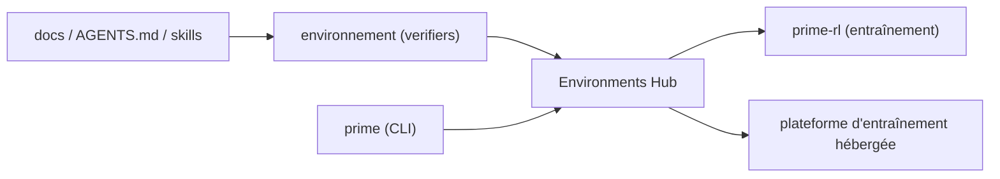

# PrimeIntellect-ai/verifiers

> Bibliothèque de création d'environnements pour entraîner et évaluer des modèles de langage.

## Le problème
Entraîner ou évaluer un LLM sur une tâche demande un environnement : boucle d'interaction, critère
de réussite, récompense. Sans cadre commun, chaque tâche est réécrite de zéro et incomparable.

## Ce que ça fait vraiment
Le README dit trois choses seulement : c'est la bibliothèque de Prime Intellect pour créer des
environnements d'entraînement et d'évaluation de LLM ; elle est étroitement intégrée à l'Environments
Hub, au framework d'entraînement `prime-rl` et à la plateforme d'entraînement hébergée ; et le CLI
`prime` est le moyen recommandé d'interagir avec les environnements. Tout le reste est renvoyé à la
documentation, au fichier `AGENTS.md` et aux skills destinés aux agents de code.

## Comment c'est branché


## Essayer
```bash
curl -LsSf https://astral.sh/uv/install.sh | sh
uv tool install prime
```

## Coût et pièges
Gratuit côté bibliothèque. L'Environments Hub et la plateforme hébergée sont des services de
l'éditeur : compte nécessaire, et le coût d'un entraînement hébergé n'est pas documenté ici.

## Ce que ce n'est pas
Pas un framework d'entraînement : c'est `prime-rl` qui entraîne, verifiers ne fait que les
environnements. README sous les 800 caractères : aucune API, aucun exemple, aucune structure de
projet visible — fiche minimale, tout est à vérifier dans la doc externe avant d'y investir.

## Alternatives
- `prime-rl` : la partie entraînement du même éditeur, si le besoin est l'optimisation.

## Pour toi
À garder en tête pour construire des évaluations réutilisables ; illisible depuis ce seul README.
