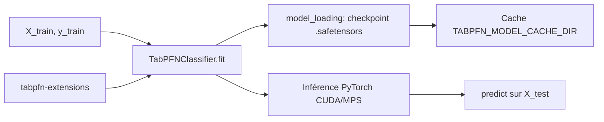

# PriorLabs/TabPFN

> Modèle de fondation tabulaire qui classe et régresse sans entraînement, via une API scikit-learn.

## Le problème
Sur données tabulaires, chaque nouveau jeu impose un cycle complet : préparation, choix
d'algorithme, recherche d'hyperparamètres. Long, et souvent pour retomber sur un gradient boosting.

## Ce que ça fait vraiment
`TabPFNClassifier` et `TabPFNRegressor` s'utilisent comme des estimateurs sklearn : `fit` puis
`predict`, le checkpoint se télécharge au premier appel. Le défaut TabPFN-3.5 accepte jusqu'à
1 000 000 lignes et 20 000 colonnes ; une variante Fast existe, et les anciennes versions restent
accessibles par `ModelVersion`. Gère les valeurs manquantes. Un estimateur ajusté se sérialise
avec `save_fitted_tabpfn_model`.

## Comment c'est branché


## Essayer
```bash
pip install tabpfn
pip install tabpfn-extensions
python scripts/download_all_models.py
export TABPFN_MODEL_CACHE_DIR="/path/to/models"
export TABPFN_ALLOW_CPU_LARGE_DATASET=true
```

## Coût et pièges
Python 3.10+. GPU vivement conseillé : sur CPU, plafond à 5 000 échantillons sauf variable
d'environnement. Au premier usage une fenêtre de navigateur s'ouvre pour **accepter la licence**
PriorLabs ; en CI il faut poser `TABPFN_TOKEN`. Chaque `predict` recalcule le jeu
d'entraînement — prédire 100 échantillons un par un coûte presque 100 fois plus cher.

## Ce que ce n'est pas
Ce n'est pas librement réutilisable en production : l'usage commercial passe par une Enterprise
Edition et un contact commercial. Ce n'est pas un modèle à pré-traiter : mise à l'échelle et
one-hot sont explicitement contre-productifs.

## Alternatives
- **TabPFN Client** : inférence hébergée, si tu n'as pas de GPU.
- **TabPFN UX** : interface sans code, pour explorer avant d'intégrer.

## Pour toi
À tester sérieusement sur tes jeux tabulaires — mais vérifie la licence avant tout usage client.
