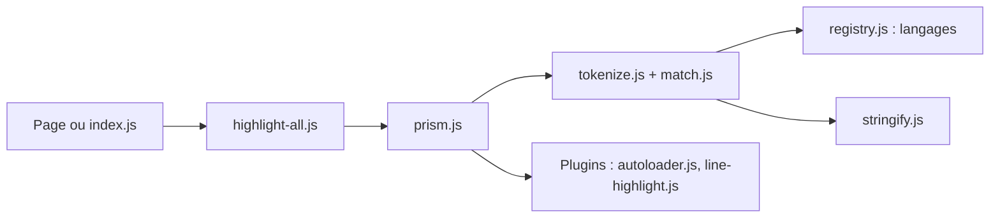

# PrismJS/prism

> Bibliothèque de coloration syntaxique pour navigateurs et Node.js, extensible par langages et plugins.

## Le problème
Afficher du code lisible et coloré dans une page web sans écrire un tokenizer.

## Ce que ça fait vraiment
Prend un texte ou un élément `code`, résout la grammaire du langage, découpe en jetons et produit du HTML coloré. Des plugins ajoutent chargement automatique des langages, numéros de ligne, prévisualisations, ligne de commande. Le README indique qu'une v2 est en chantier : seules les PR de sécurité sont acceptées.

## Comment c'est branché


## Essayer
```bash
npm ci
npm run build
```
(commandes de contribution ; le README ne détaille pas l'usage.)

## Coût et pièges
Gratuit. Ne pas éditer `prism.js` : il est généré à partir de `components/`. Utiliser `npm ci`, pas `npm install`.

## Ce que ce n'est pas
Le README ne documente pas l'utilisation, seulement la contribution (l'usage est sur prismjs.com). Pas d'analyse sémantique du code.

## Alternatives
- prism-themes : pour ajouter des thèmes.

## Pour toi
À ignorer : utile pour un blog ou une doc web, sans intérêt direct pour data/IA.

